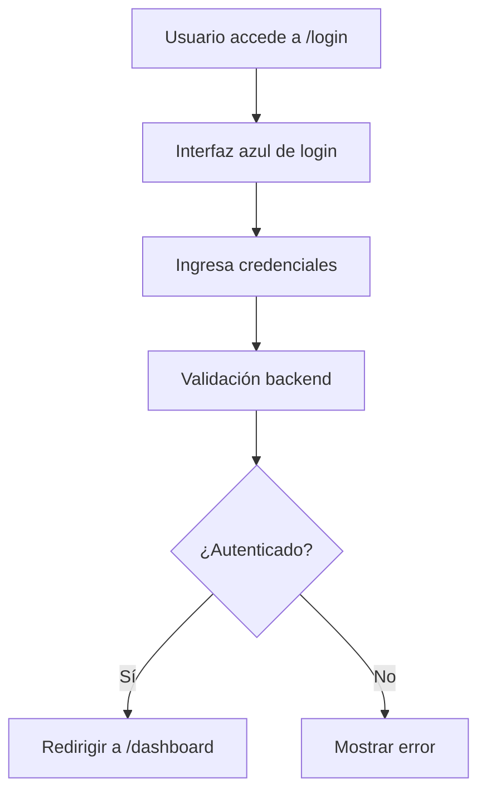
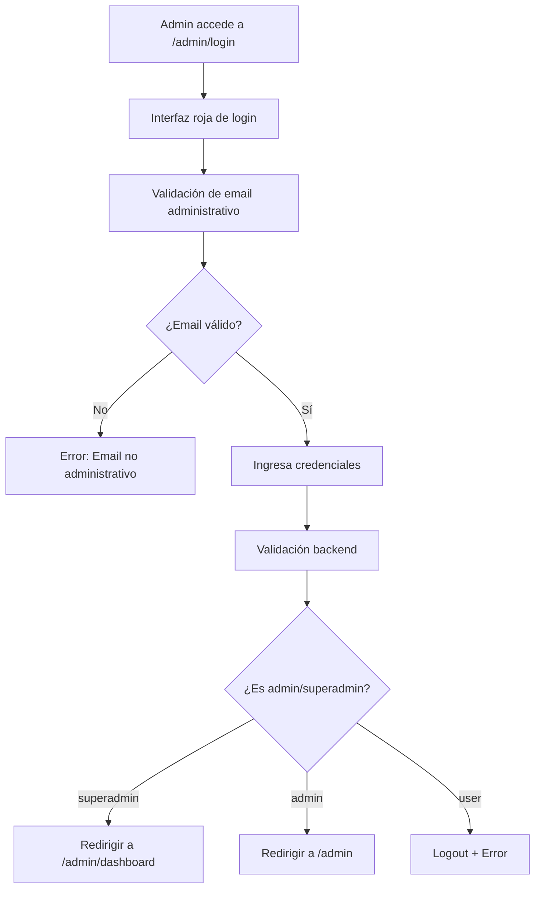

# Sistema de Login Dual - VoiceAuth

El sistema VoiceAuth ahora cuenta con **dos sistemas de login separados** para diferentes tipos de usuarios, proporcionando mejor seguridad y separación de responsabilidades.

## 🔐 Tipos de Login

### 1. **Login de Usuarios Regulares** 
**Ruta:** `/login`  
**Usuarios:** Personal general, empleados

#### Características:
- ✅ Interfaz azul (colores corporativos)
- ✅ Acceso a funcionalidades básicas
- ✅ Registro de voz personal
- ✅ Verificación biométrica
- ✅ Dashboard personal

#### Rutas Disponibles:
```
/dashboard          - Panel personal
/enrollment         - Registro de voz
/verification       - Verificación biométrica
```

### 2. **Login Administrativo**
**Ruta:** `/admin/login`  
**Usuarios:** Administradores de empresa y super administradores

#### Características:
- 🛡️ Interfaz roja/naranja (colores administrativos)
- 🛡️ Validación estricta de permisos
- 🛡️ Acceso a paneles de administración
- 🛡️ Gestión de usuarios
- 🛡️ Estadísticas del sistema

#### Rutas Disponibles:
```
/admin              - Panel de administración de empresa
/admin/dashboard    - Panel de super administrador
```

## 👥 Jerarquía de Usuarios

### 🟢 **Usuario Regular** (`user`)
- **Login:** `/login`
- **Dashboard:** `/dashboard`
- **Permisos:** 
  - Registro de voz personal
  - Verificación biométrica
  - Visualización de estadísticas personales

### 🟠 **Administrador de Empresa** (`admin`)
- **Login:** `/admin/login`
- **Dashboard:** `/admin`
- **Permisos:**
  - Gestión de usuarios de su empresa
  - Estadísticas de la empresa
  - Configuración de empresa
  - **NO puede ver otras empresas**

### 🔴 **Super Administrador** (`superadmin`)
- **Login:** `/admin/login`
- **Dashboard:** `/admin/dashboard`
- **Permisos:**
  - Acceso completo al sistema
  - Gestión de todas las empresas
  - Gestión global de usuarios
  - Configuración del sistema
  - Monitoreo del sistema

## 🚀 Cómo Funciona

### Flujo de Autenticación Regular


### Flujo de Autenticación Administrativa


## 🔧 Configuración de Seguridad

### Validación en Frontend
```javascript
// AdminLoginPage.jsx
const validateAdminEmail = (email) => {
  const adminEmails = [
    'superadmin@voiceauth.com',
    'admin@empresaa.com', 
    'admin@empresab.com'
  ];
  return adminEmails.includes(email.toLowerCase());
};
```

### Protección de Rutas
```javascript
// App.jsx
const ProtectedRoute = ({ children, adminOnly, superAdminOnly }) => {
  if (superAdminOnly && user?.role !== 'superadmin') {
    return <Navigate to="/dashboard" replace />;
  }
  
  if (adminOnly && !['admin', 'superadmin'].includes(user?.role)) {
    return <Navigate to="/dashboard" replace />;
  }
  
  return children;
};
```

## 🎯 Credenciales de Prueba

### Super Administrador
```
Email: superadmin@voiceauth.com
Password: SuperAdmin2024!
Acceso: Sistema completo
```

### Administrador Empresa A
```
Email: admin@empresaa.com  
Password: AdminEmpresa2024!
Acceso: Solo usuarios de Empresa A
```

### Administrador Empresa B
```
Email: admin@empresab.com
Password: AdminEmpresa2024!
Acceso: Solo usuarios de Empresa B
```

### Usuario Regular
```
Email: test@test.com
Password: User2024!
Acceso: Panel personal únicamente
```

## 🛠️ URLs del Sistema

### URLs Públicas
```
http://localhost:5173/login           - Login usuarios
http://localhost:5173/register        - Registro usuarios  
http://localhost:5173/admin/login     - Login administrativo
```

### URLs Protegidas (Usuario)
```
http://localhost:5173/dashboard       - Panel personal
http://localhost:5173/enrollment      - Registro de voz
http://localhost:5173/verification    - Verificación
```

### URLs Protegidas (Admin)
```
http://localhost:5173/admin           - Panel admin empresa
http://localhost:5173/admin/dashboard - Panel super admin
```

## 🔒 Características de Seguridad

### 1. **Separación de Interfaces**
- Diferentes colores y estilos visuales
- Validaciones específicas por tipo de usuario
- Credenciales de ejemplo claramente marcadas

### 2. **Validación Múltiple**
- Frontend: Validación de email administrativo
- Backend: Verificación de roles y permisos
- Rutas: Protección por componentes de autenticación

### 3. **Redirección Inteligente**
- Usuarios autenticados van a su dashboard apropiado
- Usuarios no autenticados van al login correspondiente
- Accesos no autorizados se bloquean automáticamente

### 4. **Logging y Monitoreo**
- Todos los intentos de login se registran
- Diferenciación entre login regular y administrativo
- Alertas de accesos no autorizados

## 🚦 Estados de la Aplicación

### Usuario No Autenticado
```
/                    → Redirect /login
/login              → Login regular
/admin/login        → Login administrativo  
/dashboard          → Redirect /login
/admin              → Redirect /login
```

### Usuario Regular Autenticado  
```
/                    → Redirect /dashboard
/login              → Redirect /dashboard
/admin/login        → Redirect /dashboard
/dashboard          → ✅ Dashboard personal
/admin              → Redirect /dashboard (sin permisos)
```

### Admin de Empresa Autenticado
```
/                    → Redirect /dashboard
/login              → Redirect /dashboard  
/admin/login        → Redirect /admin
/dashboard          → ✅ Dashboard personal
/admin              → ✅ Panel administrativo
/admin/dashboard    → Redirect /dashboard (sin permisos)
```

### Super Admin Autenticado
```
/                    → Redirect /dashboard
/login              → Redirect /dashboard
/admin/login        → Redirect /admin/dashboard
/dashboard          → ✅ Dashboard personal
/admin              → ✅ Panel administrativo
/admin/dashboard    → ✅ Panel super admin
```

## 🔄 Migración y Compatibilidad

### URLs Existentes
- ✅ **Todas las URLs existentes funcionan igual**
- ✅ **No se modificó el comportamiento de usuarios regulares**
- ✅ **Login regular mantiene toda su funcionalidad**

### Nuevas URLs
- 🆕 `/admin/login` - Login administrativo
- 🆕 `/admin/dashboard` - Panel super administrador
- 🔧 `/admin` - Mejorado con filtros por empresa

## 📱 Navegación del Sistema

### Desde Login Regular
```
Login (/login)
├── 👤 Usuario → Dashboard Personal
├── 🔗 Registro → Registro de usuarios
└── 🛡️ Acceso Administrativo → Login Admin
```

### Desde Login Administrativo  
```
Admin Login (/admin/login)
├── 🟠 Admin Empresa → Panel Admin (/admin)
├── 🔴 Super Admin → Panel Super (/admin/dashboard)  
├── 👤 Usuario Regular → Login Regular (/login)
└── ❌ Usuario sin permisos → Error + Logout
```

## 🎨 Diferencias Visuales

### Login Regular
- 🔵 **Colores:** Azul corporativo
- 🏢 **Icono:** Micrófono
- 📝 **Título:** "Bienvenido a VoiceAuth"
- 🎯 **Enfoque:** Funcionalidades biométricas

### Login Administrativo
- 🔴 **Colores:** Rojo/Naranja administrativo
- 🛡️ **Icono:** Escudo de seguridad
- 📝 **Título:** "Acceso Administrativo"
- 🎯 **Enfoque:** Gestión y administración
- ⚠️ **Aviso:** Texto de seguridad y autorización

---

**Nota:** Este sistema de login dual proporciona una separación clara entre usuarios regulares y administrativos, mejorando la seguridad y la experiencia de usuario según el tipo de acceso requerido.