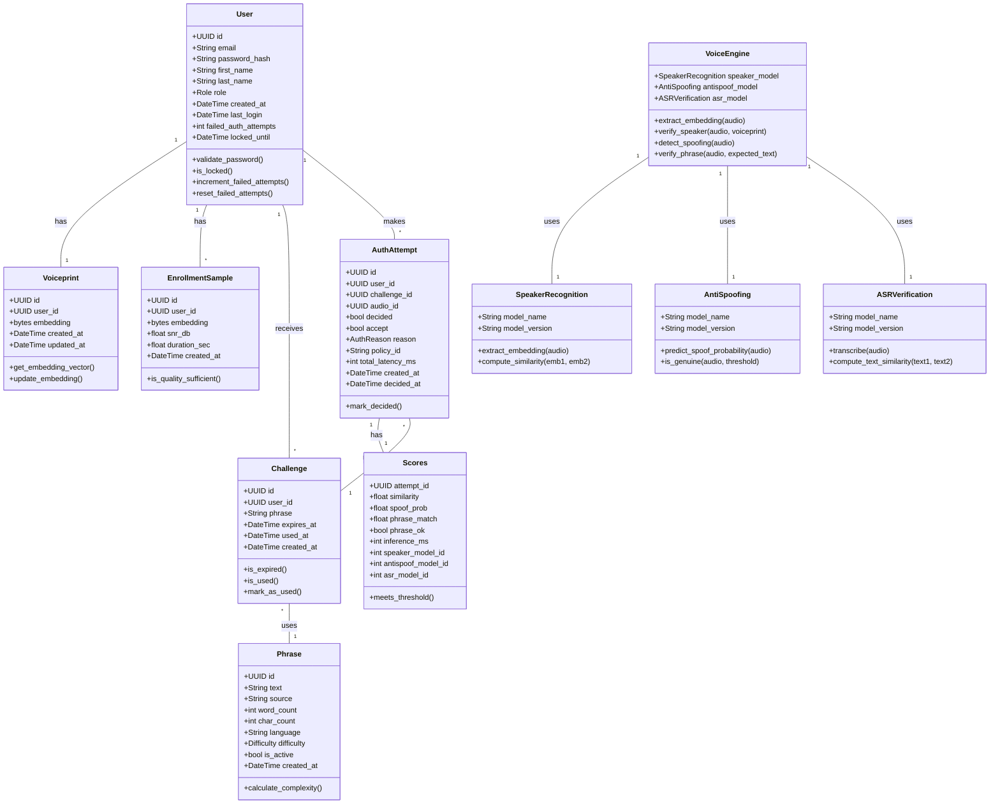

# Anexo A: Diagramas de Arquitectura UML

## Sistema de Autenticación Biométrica por Voz

**Versión:** 1.0  
**Fecha:** Diciembre 2025  
**Autor:** Tomás Ipinza Poch

---

## A.1 Diagrama de Arquitectura General (C4 - Nivel Contenedores)

```mermaid
graph TB
    subgraph "Usuario Final"
        U[👤 Usuario]
        A[👨‍💼 Administrador]
    end

    subgraph "Capa de Presentación - Frontend"
        WA[React SPA<br/>Vite + TypeScript]
        AR[Audio Recorder<br/>MediaRecorder API]
        SM[State Management<br/>TanStack Query + Context]
    end

    subgraph "Capa de API - Backend"
        AG[API Gateway<br/>FastAPI]
        AC[Auth Controller]
        EC[Enrollment Controller]
        VC[Verification Controller]
        ADC[Admin Controller]
    end

    subgraph "Capa de Aplicación - Servicios"
        AS[Auth Service]
        ES[Enrollment Service]
        VS[Verification Service]
        CS[Challenge Service]
        PS[Phrase Service]
    end

    subgraph "Capa de Dominio - Lógica de Negocio"
        VE[Voice Engine]
        SR[Speaker Recognition<br/>ECAPA-TDNN]
        ASP[Anti-Spoofing<br/>RawNet2]
        ASR[ASR Verification<br/>Wav2Vec2]
        PE[Policy Engine]
    end

    subgraph "Capa de Infraestructura"
        UR[User Repository]
        VR[Voiceprint Repository]
        PR[Phrase Repository]
        AR2[Auth Attempt Repository]
        AL[Audit Logger]
    end

    subgraph "Capa de Datos"
        DB[(PostgreSQL 16<br/>+ pgvector)]
        FS[File System<br/>Audio Storage]
        CACHE[(Redis Cache)]
    end

    U --> WA
    A --> WA
    WA --> AR
    WA --> SM
    AR --> AG
    SM --> AG

    AG --> AC
    AG --> EC
    AG --> VC
    AG --> ADC

    AC --> AS
    EC --> ES
    VC --> VS
    VC --> CS
    ADC --> PS

    AS --> UR
    ES --> VE
    ES --> VR
    VS --> VE
    VS --> CS
    CS --> PR

    VE --> SR
    VE --> ASP
    VE --> ASR
    VE --> PE

    UR --> DB
    VR --> DB
    PR --> DB
    AR2 --> DB
    AL --> DB
    VE --> FS
    VS --> CACHE

    style U fill:#e1f5ff
    style A fill:#fff4e1
    style WA fill:#e8f5e9
    style VE fill:#fff3e0
    style DB fill:#f3e5f5
    style SR fill:#ffebee
    style ASP fill:#ffebee
    style ASR fill:#ffebee
```



---

## A.2 Diagrama de Clases - Capa de Dominio



---

## A.3 Diagrama de Secuencia - Proceso de Enrolamiento

```mermaid
sequenceDiagram
    actor Usuario
    participant Frontend
    participant API
    participant EnrollmentService
    participant VoiceEngine
    participant PhraseService
    participant VoiceprintRepo
    participant DB

    Usuario->>Frontend: Inicia enrolamiento
    Frontend->>API: POST /api/enrollment/start
    API->>EnrollmentService: start_enrollment(user_id)
    EnrollmentService->>PhraseService: get_enrollment_phrases(3)
    PhraseService->>DB: SELECT phrases WHERE difficulty='medium'
    DB-->>PhraseService: phrases[]
    PhraseService-->>EnrollmentService: phrases[]
    EnrollmentService->>DB: INSERT enrollment_session
    DB-->>EnrollmentService: enrollment_id
    EnrollmentService-->>API: {enrollment_id, phrases[]}
    API-->>Frontend: {enrollment_id, phrases[]}
    Frontend-->>Usuario: Muestra frase 1

    loop Para cada frase (3 veces)
        Usuario->>Frontend: Graba audio
        Frontend->>Frontend: Valida calidad (SNR, duración)
        Frontend->>API: POST /api/enrollment/add-sample
        Note over Frontend,API: {enrollment_id, audio_blob, phrase_id}
        API->>EnrollmentService: add_sample(enrollment_id, audio, phrase_id)
        EnrollmentService->>VoiceEngine: extract_embedding(audio)
        VoiceEngine->>VoiceEngine: Procesa audio con ECAPA-TDNN
        VoiceEngine-->>EnrollmentService: embedding_vector
        EnrollmentService->>DB: INSERT enrollment_sample
        DB-->>EnrollmentService: sample_id
        EnrollmentService-->>API: {sample_id, quality_score}
        API-->>Frontend: {success: true, quality_score}
        Frontend-->>Usuario: Muestra siguiente frase
    end

    Usuario->>Frontend: Completa enrolamiento
    Frontend->>API: POST /api/enrollment/complete
    API->>EnrollmentService: complete_enrollment(enrollment_id)
    EnrollmentService->>DB: SELECT embeddings FROM enrollment_sample
    DB-->>EnrollmentService: embeddings[]
    EnrollmentService->>EnrollmentService: Calcula embedding promedio
    EnrollmentService->>VoiceprintRepo: create_voiceprint(user_id, avg_embedding)
    VoiceprintRepo->>DB: INSERT INTO voiceprint
    DB-->>VoiceprintRepo: voiceprint_id
    VoiceprintRepo-->>EnrollmentService: voiceprint
    EnrollmentService->>DB: UPDATE user SET enrolled=true
    EnrollmentService-->>API: {success: true}
    API-->>Frontend: {success: true}
    Frontend-->>Usuario: ✅ Enrolamiento completado
```



---

## A.4 Diagrama de Secuencia - Proceso de Verificación

```mermaid
sequenceDiagram
    actor Usuario
    participant Frontend
    participant API
    participant VerificationService
    participant ChallengeService
    participant VoiceEngine
    participant SpeakerModel
    participant AntiSpoofModel
    participant ASRModel
    participant PolicyEngine
    participant VoiceprintRepo
    participant AuthAttemptRepo
    participant DB

    Usuario->>Frontend: Solicita login
    Frontend->>API: POST /api/verification/start
    API->>VerificationService: start_verification(user_id)
    VerificationService->>ChallengeService: create_challenge(user_id)
    ChallengeService->>DB: SELECT phrase (no usada recientemente)
    DB-->>ChallengeService: phrase
    ChallengeService->>DB: INSERT challenge
    DB-->>ChallengeService: challenge_id
    ChallengeService-->>VerificationService: {challenge_id, phrase, expires_at}
    VerificationService-->>API: {verification_id, phrase, timeout}
    API-->>Frontend: {verification_id, phrase, timeout}
    Frontend-->>Usuario: Muestra frase a leer

    Usuario->>Frontend: Graba audio leyendo frase
    Frontend->>API: POST /api/verification/verify
    Note over Frontend,API: {verification_id, audio_blob}
    API->>VerificationService: verify(verification_id, audio)
    
    VerificationService->>DB: SELECT challenge, user
    DB-->>VerificationService: challenge, user
    VerificationService->>VerificationService: Valida challenge no expirado
    
    par Procesamiento paralelo de modelos
        VerificationService->>VoiceEngine: verify_speaker(audio, user_id)
        VoiceEngine->>SpeakerModel: extract_embedding(audio)
        SpeakerModel-->>VoiceEngine: embedding
        VoiceEngine->>VoiceprintRepo: get_voiceprint(user_id)
        VoiceprintRepo->>DB: SELECT voiceprint
        DB-->>VoiceprintRepo: voiceprint
        VoiceprintRepo-->>VoiceEngine: voiceprint_embedding
        VoiceEngine->>VoiceEngine: compute_cosine_similarity()
        VoiceEngine-->>VerificationService: similarity_score
    and
        VerificationService->>VoiceEngine: detect_spoofing(audio)
        VoiceEngine->>AntiSpoofModel: predict(audio)
        AntiSpoofModel-->>VoiceEngine: spoof_probability
        VoiceEngine-->>VerificationService: spoof_prob
    and
        VerificationService->>VoiceEngine: verify_phrase(audio, expected_phrase)
        VoiceEngine->>ASRModel: transcribe(audio)
        ASRModel-->>VoiceEngine: transcription
        VoiceEngine->>VoiceEngine: compute_text_similarity()
        VoiceEngine-->>VerificationService: phrase_match_score
    end

    VerificationService->>PolicyEngine: evaluate(similarity, spoof_prob, phrase_match)
    PolicyEngine->>PolicyEngine: Aplica umbrales de política
    Note over PolicyEngine: similarity > 0.75<br/>spoof_prob < 0.5<br/>phrase_match > 0.8
    PolicyEngine-->>VerificationService: decision{accept, reason}

    VerificationService->>AuthAttemptRepo: create_attempt(user_id, scores, decision)
    AuthAttemptRepo->>DB: INSERT auth_attempt
    DB-->>AuthAttemptRepo: attempt_id
    AuthAttemptRepo->>DB: INSERT scores
    AuthAttemptRepo-->>VerificationService: attempt
    
    alt Verificación exitosa
        VerificationService->>DB: UPDATE user SET last_login=now()
        VerificationService->>DB: UPDATE challenge SET used_at=now()
        VerificationService-->>API: {verified: true, token: JWT}
        API-->>Frontend: {verified: true, token}
        Frontend-->>Usuario: ✅ Acceso concedido
    else Verificación fallida
        VerificationService->>DB: UPDATE user INCREMENT failed_attempts
        VerificationService-->>API: {verified: false, reason}
        API-->>Frontend: {verified: false, reason}
        Frontend-->>Usuario: ❌ Acceso denegado
    end
```



---

## A.5 Diagrama de Componentes - Motor Biométrico

```mermaid
graph TB
    subgraph "Voice Engine - Motor Biométrico"
        VE[Voice Engine Facade]
        
        subgraph "Speaker Recognition Module"
            SR_LOAD[Model Loader]
            SR_PREP[Audio Preprocessor]
            SR_ECAPA[ECAPA-TDNN Model]
            SR_EMB[Embedding Extractor]
            SR_SIM[Similarity Calculator]
        end
        
        subgraph "Anti-Spoofing Module"
            AS_LOAD[Model Loader]
            AS_PREP[Audio Preprocessor]
            AS_RAW[RawNet2 Model]
            AS_PRED[Spoof Predictor]
        end
        
        subgraph "ASR Verification Module"
            ASR_LOAD[Model Loader]
            ASR_PREP[Audio Preprocessor]
            ASR_W2V[Wav2Vec2 Model]
            ASR_TRANS[Transcriber]
            ASR_MATCH[Text Matcher]
        end
        
        MM[Model Manager]
        AC[Audio Converter]
        QC[Quality Checker]
    end

    VE --> SR_LOAD
    VE --> AS_LOAD
    VE --> ASR_LOAD
    
    SR_LOAD --> MM
    AS_LOAD --> MM
    ASR_LOAD --> MM
    
    VE --> AC
    VE --> QC
    
    AC --> SR_PREP
    AC --> AS_PREP
    AC --> ASR_PREP
    
    SR_PREP --> SR_ECAPA
    SR_ECAPA --> SR_EMB
    SR_EMB --> SR_SIM
    
    AS_PREP --> AS_RAW
    AS_RAW --> AS_PRED
    
    ASR_PREP --> ASR_W2V
    ASR_W2V --> ASR_TRANS
    ASR_TRANS --> ASR_MATCH

    style VE fill:#ff9800
    style MM fill:#2196f3
    style SR_ECAPA fill:#4caf50
    style AS_RAW fill:#f44336
    style ASR_W2V fill:#9c27b0
```



---

## A.6 Diagrama de Despliegue

```mermaid
graph TB
    subgraph "Cliente - Navegador Web"
        BROWSER[Chrome/Firefox/Safari]
        REACT[React Application]
        MEDIA[MediaRecorder API]
    end

    subgraph "Servidor de Aplicación - Docker Container"
        NGINX[Nginx Reverse Proxy<br/>:80, :443]
        
        subgraph "Backend Container"
            FASTAPI[FastAPI Server<br/>:8000]
            UVICORN[Uvicorn ASGI Server]
            PYTHON[Python 3.11 Runtime]
        end
        
        subgraph "ML Models Container"
            PYTORCH[PyTorch Runtime]
            ECAPA[ECAPA-TDNN Model]
            RAWNET[RawNet2 Model]
            WAV2VEC[Wav2Vec2 Model]
        end
    end

    subgraph "Base de Datos - Docker Container"
        POSTGRES[PostgreSQL 16<br/>:5432]
        PGVECTOR[pgvector Extension]
        PGCRYPTO[pgcrypto Extension]
    end

    subgraph "Cache - Docker Container"
        REDIS[Redis Cache<br/>:6379]
    end

    subgraph "Almacenamiento Persistente"
        VOLUME_DB[PostgreSQL Data Volume]
        VOLUME_AUDIO[Audio Files Volume]
        VOLUME_MODELS[ML Models Volume]
    end

    BROWSER --> REACT
    REACT --> MEDIA
    BROWSER -->|HTTPS| NGINX
    NGINX -->|HTTP| FASTAPI
    FASTAPI --> UVICORN
    UVICORN --> PYTHON
    
    PYTHON --> PYTORCH
    PYTORCH --> ECAPA
    PYTORCH --> RAWNET
    PYTORCH --> WAV2VEC
    
    PYTHON -->|SQL| POSTGRES
    POSTGRES --> PGVECTOR
    POSTGRES --> PGCRYPTO
    
    PYTHON -->|Cache| REDIS
    
    POSTGRES --> VOLUME_DB
    PYTHON --> VOLUME_AUDIO
    PYTORCH --> VOLUME_MODELS

    style BROWSER fill:#e3f2fd
    style FASTAPI fill:#fff3e0
    style POSTGRES fill:#f3e5f5
    style REDIS fill:#ffebee
    style ECAPA fill:#e8f5e9
    style RAWNET fill:#e8f5e9
    style WAV2VEC fill:#e8f5e9
```



---

## A.7 Diagrama de Estados - Ciclo de Vida del Usuario

```mermaid
stateDiagram-v2
    [*] --> Registrado: Registro inicial
    
    Registrado --> Enrolando: Inicia enrolamiento
    
    Enrolando --> MuestrasParciales: Graba muestra 1
    MuestrasParciales --> MuestrasParciales: Graba muestras 2-3
    MuestrasParciales --> Enrolado: Completa 3+ muestras
    MuestrasParciales --> Registrado: Cancela enrolamiento
    
    Enrolado --> Verificando: Intenta login
    
    Verificando --> Autenticado: Verificación exitosa
    Verificando --> Enrolado: Verificación fallida (1-2 intentos)
    Verificando --> Bloqueado: 3+ intentos fallidos
    
    Autenticado --> Verificando: Cierra sesión
    
    Bloqueado --> Enrolado: Desbloqueo manual (admin)
    Bloqueado --> [*]: Eliminación de cuenta
    
    Enrolado --> ReEnrolando: Solicita re-enrolamiento
    ReEnrolando --> Enrolado: Completa re-enrolamiento
    
    Autenticado --> [*]: Eliminación de cuenta
    Enrolado --> [*]: Eliminación de cuenta

    note right of Enrolando
        Requiere 3-6 muestras
        de audio de calidad
    end note

    note right of Verificando
        Validación triple:
        - Similitud de voz
        - Anti-spoofing
        - Verificación de frase
    end note

    note right of Bloqueado
        Bloqueo temporal
        tras múltiples fallos
    end note
```



---

## A.8 Diagrama de Actividades - Flujo de Verificación Completo

```mermaid
flowchart TD
    Start([Usuario solicita login]) --> GetChallenge[Obtener challenge del servidor]
    GetChallenge --> DisplayPhrase[Mostrar frase a leer]
    DisplayPhrase --> RecordAudio[Grabar audio del usuario]
    
    RecordAudio --> CheckQuality{¿Audio con<br/>calidad suficiente?}
    CheckQuality -->|No| ShowError1[Mostrar error de calidad]
    ShowError1 --> RecordAudio
    CheckQuality -->|Sí| SendToServer[Enviar audio al servidor]
    
    SendToServer --> ValidateChallenge{¿Challenge<br/>válido y no<br/>expirado?}
    ValidateChallenge -->|No| ReturnError1[Error: Challenge inválido]
    ReturnError1 --> End1([Fin - Acceso denegado])
    
    ValidateChallenge -->|Sí| ParallelProcessing[Procesamiento paralelo]
    
    ParallelProcessing --> ExtractEmbedding[Extraer embedding<br/>ECAPA-TDNN]
    ParallelProcessing --> DetectSpoof[Detectar spoofing<br/>RawNet2]
    ParallelProcessing --> TranscribeAudio[Transcribir audio<br/>Wav2Vec2]
    
    ExtractEmbedding --> CalcSimilarity[Calcular similitud<br/>con voiceprint]
    DetectSpoof --> GetSpoofProb[Obtener probabilidad<br/>de spoofing]
    TranscribeAudio --> MatchPhrase[Comparar con<br/>frase esperada]
    
    CalcSimilarity --> CheckSimilarity{Similitud<br/>> 0.75?}
    GetSpoofProb --> CheckSpoof{Spoof prob<br/>< 0.5?}
    MatchPhrase --> CheckPhrase{Match<br/>> 80%?}
    
    CheckSimilarity -->|No| RejectLowSim[Razón: Baja similitud]
    CheckSpoof -->|No| RejectSpoof[Razón: Spoofing detectado]
    CheckPhrase -->|No| RejectPhrase[Razón: Frase incorrecta]
    
    RejectLowSim --> LogAttempt[Registrar intento fallido]
    RejectSpoof --> LogAttempt
    RejectPhrase --> LogAttempt
    
    CheckSimilarity -->|Sí| AllChecks{¿Todos los<br/>checks OK?}
    CheckSpoof -->|Sí| AllChecks
    CheckPhrase -->|Sí| AllChecks
    
    AllChecks -->|No| LogAttempt
    AllChecks -->|Sí| LogSuccess[Registrar intento exitoso]
    
    LogAttempt --> IncrementFails[Incrementar contador<br/>de fallos]
    IncrementFails --> CheckFailCount{¿Fallos >= 3?}
    CheckFailCount -->|Sí| LockAccount[Bloquear cuenta]
    LockAccount --> End2([Fin - Cuenta bloqueada])
    CheckFailCount -->|No| End3([Fin - Acceso denegado])
    
    LogSuccess --> GenerateToken[Generar JWT token]
    GenerateToken --> ResetFails[Resetear contador<br/>de fallos]
    ResetFails --> UpdateLastLogin[Actualizar last_login]
    UpdateLastLogin --> End4([Fin - Acceso concedido])

    style Start fill:#e3f2fd
    style End4 fill:#c8e6c9
    style End1 fill:#ffcdd2
    style End2 fill:#ffcdd2
    style End3 fill:#ffcdd2
    style ParallelProcessing fill:#fff9c4
    style AllChecks fill:#f8bbd0
```



---

## A.9 Diagrama Entidad-Relación (ERD)

```mermaid
erDiagram
    USER ||--o| VOICEPRINT : has
    USER ||--o{ ENROLLMENT_SAMPLE : has
    USER ||--o{ CHALLENGE : receives
    USER ||--o{ AUTH_ATTEMPT : makes
    USER ||--o| USER_POLICY : has
    
    PHRASE ||--o{ CHALLENGE : used_in
    PHRASE ||--o{ PHRASE_USAGE : tracked_in
    
    CHALLENGE ||--o{ AUTH_ATTEMPT : generates
    
    AUTH_ATTEMPT ||--|| SCORES : has
    AUTH_ATTEMPT }o--|| AUDIO_BLOB : references
    
    CLIENT_APP ||--o{ API_KEY : owns
    CLIENT_APP ||--o{ AUTH_ATTEMPT : initiates
    
    MODEL_VERSION ||--o{ SCORES : used_in
    MODEL_VERSION ||--o{ VOICEPRINT_HISTORY : used_in
    
    USER {
        uuid id PK
        text email UK
        text password
        text first_name
        text last_name
        text role
        timestamptz created_at
        timestamptz last_login
        int failed_auth_attempts
        timestamptz locked_until
    }
    
    VOICEPRINT {
        uuid id PK
        uuid user_id FK
        bytea embedding
        timestamptz created_at
        timestamptz updated_at
    }
    
    ENROLLMENT_SAMPLE {
        uuid id PK
        uuid user_id FK
        bytea embedding
        real snr_db
        real duration_sec
        timestamptz created_at
    }
    
    PHRASE {
        uuid id PK
        text text
        text source
        int word_count
        int char_count
        text language
        text difficulty
        bool is_active
        timestamptz created_at
    }
    
    CHALLENGE {
        uuid id PK
        uuid user_id FK
        text phrase
        timestamptz expires_at
        timestamptz used_at
        timestamptz created_at
    }
    
    AUTH_ATTEMPT {
        uuid id PK
        uuid user_id FK
        uuid client_id FK
        uuid challenge_id FK
        uuid audio_id FK
        bool decided
        bool accept
        text reason
        text policy_id
        int total_latency_ms
        timestamptz created_at
        timestamptz decided_at
    }
    
    SCORES {
        uuid attempt_id PK_FK
        real similarity
        real spoof_prob
        real phrase_match
        bool phrase_ok
        int inference_ms
        int speaker_model_id FK
        int antispoof_model_id FK
        int asr_model_id FK
    }
    
    AUDIO_BLOB {
        uuid id PK
        bytea content
        text mime
        timestamptz created_at
    }
    
    USER_POLICY {
        uuid user_id PK_FK
        bool keep_audio
        int retention_days
        timestamptz consent_at
    }
    
    CLIENT_APP {
        uuid id PK
        text name UK
        text contact_email
    }
    
    API_KEY {
        uuid id PK
        uuid client_id FK
        text key_hash UK
        timestamptz created_at
        timestamptz revoked_at
    }
    
    MODEL_VERSION {
        int id PK
        text kind
        text name
        text version
    }
    
    PHRASE_USAGE {
        uuid id PK
        uuid phrase_id FK
        uuid user_id FK
        text used_for
        timestamptz used_at
    }
    
    VOICEPRINT_HISTORY {
        uuid id PK
        uuid user_id FK
        bytea embedding
        timestamptz created_at
        int speaker_model_id FK
    }
    
    AUDIT_LOG {
        bigint id PK
        timestamptz timestamp
        text actor
        text action
        text entity_type
        text entity_id
        jsonb metadata
        bool success
        text error_message
    }
```

---

## A.10 Diagrama de Paquetes - Estructura del Backend

```mermaid
graph TB
    subgraph "src - Raíz del Backend"
        MAIN[main.py<br/>FastAPI App]
        CONFIG[config.py<br/>Configuración]
    end

    subgraph "api - Capa de Presentación"
        AUTH_CTRL[auth_controller.py]
        ENROLL_CTRL[enrollment_controller.py]
        VERIFY_CTRL[verification_controller.py]
        ADMIN_CTRL[admin_controller.py]
        PHRASE_CTRL[phrase_controller.py]
        DEPS[dependencies.py]
    end

    subgraph "application - Capa de Aplicación"
        AUTH_SVC[auth_service.py]
        ENROLL_SVC[enrollment_service.py]
        VERIFY_SVC[verification_service.py]
        CHALLENGE_SVC[challenge_service.py]
        PHRASE_SVC[phrase_service.py]
        
        subgraph "dto"
            DTO_FILES[DTOs de Request/Response]
        end
        
        subgraph "policies"
            POLICY_FILES[Políticas de Verificación]
        end
    end

    subgraph "domain - Capa de Dominio"
        subgraph "model"
            USER_MODEL[user.py]
            VOICEPRINT_MODEL[voiceprint.py]
            PHRASE_MODEL[phrase.py]
            CHALLENGE_MODEL[challenge.py]
            AUTH_MODEL[auth_attempt.py]
        end
        
        subgraph "services"
            VOICE_ENGINE[voice_engine.py]
            AUDIO_PROC[audio_processor.py]
        end
        
        subgraph "repositories"
            USER_REPO[user_repository.py]
            VOICEPRINT_REPO[voiceprint_repository.py]
            PHRASE_REPO[phrase_repository.py]
            AUTH_REPO[auth_attempt_repository.py]
        end
    end

    subgraph "infrastructure - Capa de Infraestructura"
        DB_CONN[database.py]
        MODEL_MGR[model_manager.py]
        AUDIO_STORE[audio_storage.py]
        CACHE[cache_service.py]
        LOGGER[logger.py]
        CRYPTO[crypto_service.py]
    end

    subgraph "shared - Utilidades Compartidas"
        EXCEPTIONS[exceptions.py]
        VALIDATORS[validators.py]
        CONSTANTS[constants.py]
    end

    MAIN --> AUTH_CTRL
    MAIN --> ENROLL_CTRL
    MAIN --> VERIFY_CTRL
    MAIN --> ADMIN_CTRL
    MAIN --> PHRASE_CTRL

    AUTH_CTRL --> AUTH_SVC
    ENROLL_CTRL --> ENROLL_SVC
    VERIFY_CTRL --> VERIFY_SVC
    PHRASE_CTRL --> PHRASE_SVC

    AUTH_SVC --> USER_REPO
    ENROLL_SVC --> VOICEPRINT_REPO
    ENROLL_SVC --> VOICE_ENGINE
    VERIFY_SVC --> VOICE_ENGINE
    VERIFY_SVC --> CHALLENGE_SVC
    CHALLENGE_SVC --> PHRASE_REPO

    VOICE_ENGINE --> MODEL_MGR
    VOICE_ENGINE --> AUDIO_PROC

    USER_REPO --> DB_CONN
    VOICEPRINT_REPO --> DB_CONN
    PHRASE_REPO --> DB_CONN
    AUTH_REPO --> DB_CONN

    VOICE_ENGINE --> CRYPTO
    VERIFY_SVC --> CACHE

    style MAIN fill:#ff9800
    style VOICE_ENGINE fill:#4caf50
    style DB_CONN fill:#2196f3
    style MODEL_MGR fill:#9c27b0
```



---

## Conclusión

Este anexo presenta la arquitectura completa del Sistema de Autenticación Biométrica por Voz mediante diagramas UML que cubren:

1. **Arquitectura general** (C4 - Contenedores)
2. **Modelo de clases** del dominio
3. **Diagramas de secuencia** para enrolamiento y verificación
4. **Arquitectura de componentes** del motor biométrico
5. **Diagrama de despliegue** con Docker
6. **Diagrama de estados** del ciclo de vida del usuario
7. **Diagrama de actividades** del flujo de verificación
8. **Diagrama entidad-relación** de la base de datos
9. **Diagrama de paquetes** de la estructura del código

Estos diagramas proporcionan una visión completa y detallada de la arquitectura del sistema, facilitando su comprensión, mantenimiento y evolución futura.
