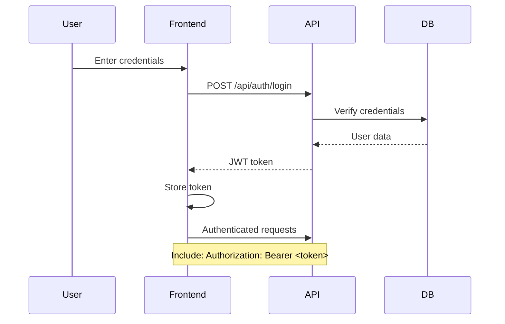
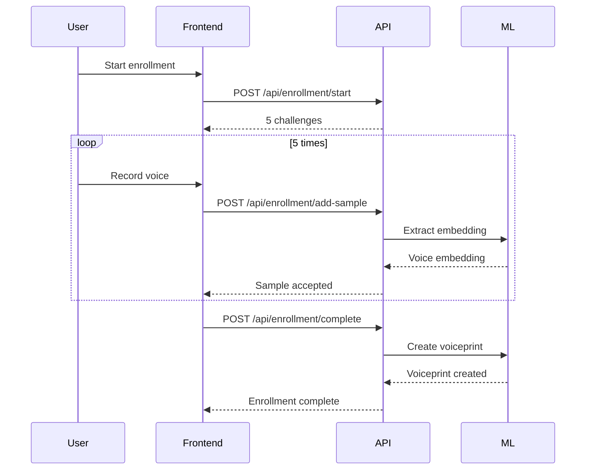
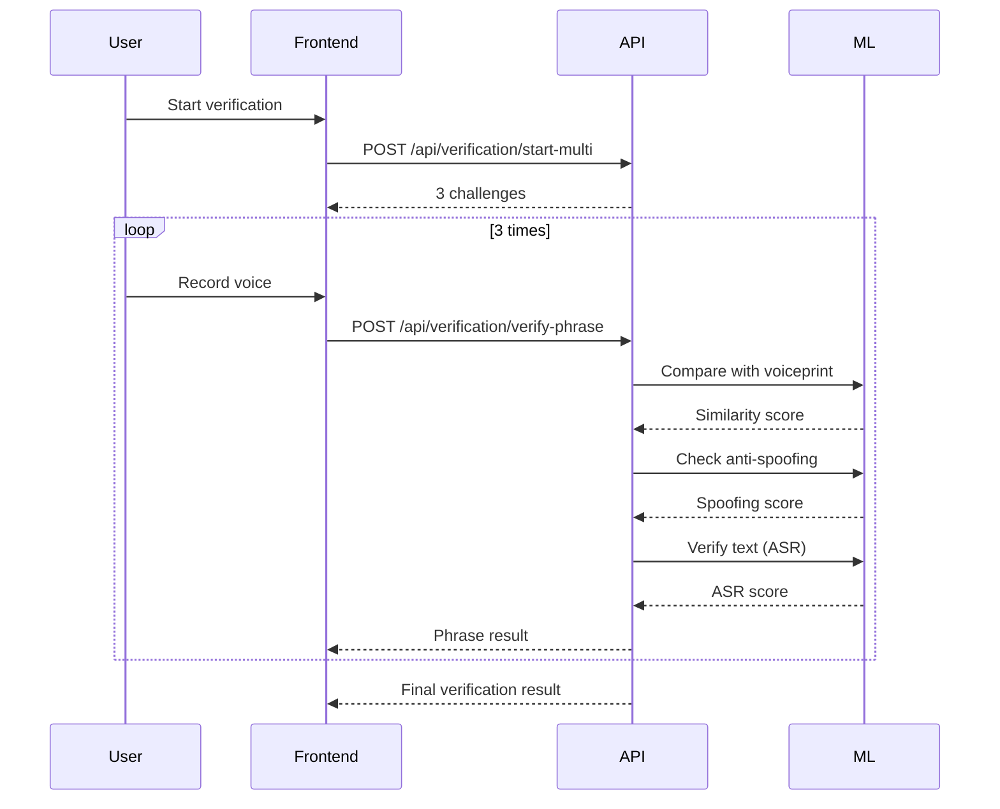

# Voice Biometrics API Documentation

**Version**: 1.0.0  
**Base URL**: `http://localhost:8000`  
**Documentation**: `http://localhost:8000/docs`

---

## Table of Contents

1. [Authentication](#authentication)
2. [Enrollment](#enrollment)
3. [Verification](#verification)
4. [Challenges](#challenges)
5. [Administration](#administration)
6. [Error Codes](#error-codes)
7. [Rate Limiting](#rate-limiting)

---

## Authentication

### POST `/api/auth/register`

Register a new user account.

**Request Body:**
```json
{
  "name": "John Doe",
  "email": "john@example.com",
  "password": "SecurePassword123!",
  "company": "Acme Corp" // optional
}
```

**Response:** `201 Created`
```json
{
  "message": "User registered successfully",
  "user_id": "550e8400-e29b-41d4-a716-446655440000"
}
```

---

### POST `/api/auth/login`

Authenticate user and get access token.

**Request Body:**
```json
{
  "email": "john@example.com",
  "password": "SecurePassword123!"
}
```

**Response:** `200 OK`
```json
{
  "access_token": "eyJhbGciOiJIUzI1NiIsInR5cCI6IkpXVCJ9...",
  "token_type": "bearer",
  "user": {
    "id": "550e8400-e29b-41d4-a716-446655440000",
    "email": "john@example.com",
    "name": "John Doe",
    "role": "user",
    "company": "Acme Corp"
  }
}
```

---

### POST `/api/auth/logout`

Logout current user (invalidate token).

**Headers:**
```
Authorization: Bearer <access_token>
```

**Response:** `200 OK`
```json
{
  "message": "Logged out successfully"
}
```

---

### GET `/api/auth/profile`

Get current user profile.

**Headers:**
```
Authorization: Bearer <access_token>
```

**Response:** `200 OK`
```json
{
  "id": "550e8400-e29b-41d4-a716-446655440000",
  "email": "john@example.com",
  "name": "John Doe",
  "role": "user",
  "company": "Acme Corp",
  "created_at": "2025-12-01T10:00:00Z",
  "settings": {}
}
```

---

### PATCH `/api/auth/profile`

Update user profile.

**Headers:**
```
Authorization: Bearer <access_token>
```

**Request Body:**
```json
{
  "name": "John Smith",
  "company": "New Corp"
}
```

**Response:** `200 OK`
```json
{
  "id": "550e8400-e29b-41d4-a716-446655440000",
  "email": "john@example.com",
  "name": "John Smith",
  "company": "New Corp"
}
```

---

### POST `/api/auth/change-password`

Change user password.

**Headers:**
```
Authorization: Bearer <access_token>
```

**Request Body:**
```json
{
  "current_password": "OldPassword123!",
  "new_password": "NewPassword456!"
}
```

**Response:** `200 OK`
```json
{
  "message": "Password changed successfully"
}
```

---

### POST `/api/auth/refresh`

Refresh access token.

**Request Body:**
```json
{
  "refresh_token": "eyJhbGciOiJIUzI1NiIsInR5cCI6IkpXVCJ9..."
}
```

**Response:** `200 OK`
```json
{
  "access_token": "eyJhbGciOiJIUzI1NiIsInR5cCI6IkpXVCJ9...",
  "token_type": "bearer"
}
```

---

## Enrollment

### POST `/api/enrollment/start`

Start voice enrollment process.

**Headers:**
```
Authorization: Bearer <access_token>
```

**Request Body:**
```json
{
  "user_id": "550e8400-e29b-41d4-a716-446655440000",
  "difficulty": "medium" // optional: easy, medium, hard
}
```

**Response:** `200 OK`
```json
{
  "enrollment_id": "660e8400-e29b-41d4-a716-446655440001",
  "challenges": [
    {
      "challenge_id": "770e8400-e29b-41d4-a716-446655440002",
      "phrase": "El rápido zorro marrón salta sobre el perro perezoso",
      "difficulty": "medium",
      "expires_at": "2025-12-09T20:32:00Z"
    },
    // ... 4 more challenges
  ],
  "required_samples": 5,
  "message": "Enrollment started. Please record 5 voice samples."
}
```

---

### POST `/api/enrollment/add-sample`

Add voice sample to enrollment.

**Headers:**
```
Authorization: Bearer <access_token>
Content-Type: multipart/form-data
```

**Request Body (Form Data):**
```
enrollment_id: 660e8400-e29b-41d4-a716-446655440001
challenge_id: 770e8400-e29b-41d4-a716-446655440002
sample_number: 1
audio: <audio file (WAV/WebM)>
```

**Response:** `200 OK`
```json
{
  "sample_id": "880e8400-e29b-41d4-a716-446655440003",
  "sample_number": 1,
  "quality_score": 0.92,
  "snr_db": 25.3,
  "duration_sec": 4.2,
  "samples_completed": 1,
  "samples_required": 5,
  "message": "Sample 1/5 added successfully"
}
```

---

### POST `/api/enrollment/complete`

Complete enrollment and create voiceprint.

**Headers:**
```
Authorization: Bearer <access_token>
```

**Request Body:**
```json
{
  "enrollment_id": "660e8400-e29b-41d4-a716-446655440001"
}
```

**Response:** `200 OK`
```json
{
  "voiceprint_id": "990e8400-e29b-41d4-a716-446655440004",
  "user_id": "550e8400-e29b-41d4-a716-446655440000",
  "samples_used": 5,
  "average_quality": 0.89,
  "created_at": "2025-12-09T20:35:00Z",
  "message": "Enrollment completed successfully"
}
```

---

### GET `/api/enrollment/status/{user_id}`

Get enrollment status for a user.

**Headers:**
```
Authorization: Bearer <access_token>
```

**Response:** `200 OK`
```json
{
  "user_id": "550e8400-e29b-41d4-a716-446655440000",
  "is_enrolled": true,
  "voiceprint_id": "990e8400-e29b-41d4-a716-446655440004",
  "enrollment_date": "2025-12-09T20:35:00Z",
  "samples_count": 5
}
```

---

## Verification

### POST `/api/verification/start-multi`

Start multi-phrase verification (3 phrases).

**Headers:**
```
Authorization: Bearer <access_token>
```

**Request Body:**
```json
{
  "user_id": "550e8400-e29b-41d4-a716-446655440000",
  "difficulty": "medium" // optional: easy, medium, hard
}
```

**Response:** `200 OK`
```json
{
  "verification_id": "aa0e8400-e29b-41d4-a716-446655440005",
  "challenges": [
    {
      "challenge_id": "bb0e8400-e29b-41d4-a716-446655440006",
      "phrase": "La tecnología avanza rápidamente en el siglo veintiuno",
      "difficulty": "medium",
      "expires_at": "2025-12-09T20:37:30Z"
    },
    // ... 2 more challenges
  ],
  "required_phrases": 3,
  "message": "Verification started. Please read 3 phrases."
}
```

---

### POST `/api/verification/verify-phrase`

Verify a single phrase.

**Headers:**
```
Authorization: Bearer <access_token>
Content-Type: multipart/form-data
```

**Request Body (Form Data):**
```
verification_id: aa0e8400-e29b-41d4-a716-446655440005
challenge_id: bb0e8400-e29b-41d4-a716-446655440006
phrase_number: 1
audio: <audio file (WAV/WebM)>
```

**Response:** `200 OK`
```json
{
  "phrase_number": 1,
  "similarity_score": 0.87,
  "anti_spoofing_score": 0.92,
  "asr_score": 0.95,
  "final_score": 0.85,
  "is_verified": false,
  "is_complete": false,
  "phrases_verified": 1,
  "phrases_required": 3,
  "message": "Phrase 1/3 verified"
}
```

**Response (Final - All 3 phrases):** `200 OK`
```json
{
  "phrase_number": 3,
  "similarity_score": 0.89,
  "anti_spoofing_score": 0.94,
  "asr_score": 0.93,
  "final_score": 0.87,
  "average_score": 0.86,
  "is_verified": true,
  "is_complete": true,
  "phrases_verified": 3,
  "phrases_required": 3,
  "threshold_used": 0.75,
  "all_results": [
    {
      "phrase_number": 1,
      "final_score": 0.85,
      "asr_penalty": 1.0
    },
    {
      "phrase_number": 2,
      "final_score": 0.86,
      "asr_penalty": 1.0
    },
    {
      "phrase_number": 3,
      "final_score": 0.87,
      "asr_penalty": 1.0
    }
  ],
  "message": "Verification completed successfully"
}
```

---

## Challenges

### POST `/api/challenges/create`

Create a single challenge.

**Headers:**
```
Authorization: Bearer <access_token>
```

**Request Body (Form Data):**
```
user_id: 550e8400-e29b-41d4-a716-446655440000
difficulty: medium // optional
```

**Response:** `200 OK`
```json
{
  "success": true,
  "challenge": {
    "challenge_id": "cc0e8400-e29b-41d4-a716-446655440007",
    "phrase": "El conocimiento es poder en la era digital",
    "phrase_id": "dd0e8400-e29b-41d4-a716-446655440008",
    "difficulty": "medium",
    "expires_at": "2025-12-09T20:38:30Z",
    "expires_in_seconds": 90
  },
  "message": "Challenge created successfully"
}
```

---

### POST `/api/challenges/create-batch`

Create multiple challenges at once.

**Headers:**
```
Authorization: Bearer <access_token>
```

**Request Body (Form Data):**
```
user_id: 550e8400-e29b-41d4-a716-446655440000
count: 3
difficulty: medium // optional
```

**Response:** `200 OK`
```json
{
  "success": true,
  "challenges": [
    {
      "challenge_id": "ee0e8400-e29b-41d4-a716-446655440009",
      "phrase": "La ciencia busca respuestas a preguntas complejas",
      "difficulty": "medium",
      "expires_at": "2025-12-09T20:38:30Z",
      "expires_in_seconds": 90
    },
    // ... 2 more
  ],
  "count": 3,
  "message": "Created 3 challenges successfully"
}
```

---

### GET `/api/challenges/{challenge_id}`

Get challenge details.

**Response:** `200 OK`
```json
{
  "success": true,
  "challenge": {
    "id": "ee0e8400-e29b-41d4-a716-446655440009",
    "user_id": "550e8400-e29b-41d4-a716-446655440000",
    "phrase": "La ciencia busca respuestas a preguntas complejas",
    "phrase_id": "ff0e8400-e29b-41d4-a716-446655440010",
    "difficulty": "medium",
    "expires_at": "2025-12-09T20:38:30Z",
    "used_at": null,
    "created_at": "2025-12-09T20:37:00Z"
  }
}
```

---

### GET `/api/challenges/{challenge_id}/time-remaining`

Get remaining time for a challenge.

**Response:** `200 OK`
```json
{
  "success": true,
  "expired": false,
  "seconds_remaining": 75,
  "expires_at": "2025-12-09T20:38:30Z"
}
```

**Response (Expired):** `200 OK`
```json
{
  "success": true,
  "expired": true,
  "seconds_remaining": 0,
  "expires_at": "2025-12-09T20:38:30Z"
}
```

---

### GET `/api/challenges/user/{user_id}/active`

Get active challenge for a user.

**Response:** `200 OK`
```json
{
  "success": true,
  "challenge": {
    "id": "ee0e8400-e29b-41d4-a716-446655440009",
    "phrase": "La ciencia busca respuestas a preguntas complejas",
    "difficulty": "medium",
    "expires_at": "2025-12-09T20:38:30Z"
  }
}
```

---

### POST `/api/challenges/validate`

Validate a challenge.

**Request Body (Form Data):**
```
challenge_id: ee0e8400-e29b-41d4-a716-446655440009
user_id: 550e8400-e29b-41d4-a716-446655440000
```

**Response:** `200 OK`
```json
{
  "success": true,
  "is_valid": true,
  "reason": "Valid"
}
```

---

### POST `/api/challenges/cleanup`

Clean up expired challenges (admin).

**Response:** `200 OK`
```json
{
  "success": true,
  "deleted_count": 258,
  "message": "Cleaned up 258 expired challenges"
}
```

---

## Administration

### GET `/api/admin/users`

Get paginated list of users (admin only).

**Headers:**
```
Authorization: Bearer <admin_access_token>
```

**Query Parameters:**
```
page: 1
page_size: 20
```

**Response:** `200 OK`
```json
{
  "users": [
    {
      "id": "550e8400-e29b-41d4-a716-446655440000",
      "email": "john@example.com",
      "name": "John Doe",
      "role": "user",
      "company": "Acme Corp",
      "created_at": "2025-12-01T10:00:00Z",
      "is_enrolled": true
    }
  ],
  "total": 150,
  "page": 1,
  "page_size": 20,
  "total_pages": 8
}
```

---

### GET `/api/admin/stats`

Get system statistics (admin only).

**Headers:**
```
Authorization: Bearer <admin_access_token>
```

**Response:** `200 OK`
```json
{
  "total_users": 150,
  "enrolled_users": 120,
  "total_verifications": 1250,
  "successful_verifications": 1100,
  "failed_verifications": 150,
  "success_rate": 0.88,
  "total_phrases": 37407,
  "active_challenges": 15
}
```

---

### GET `/api/admin/activity`

Get recent activity logs (admin only).

**Headers:**
```
Authorization: Bearer <admin_access_token>
```

**Query Parameters:**
```
limit: 50
offset: 0
```

**Response:** `200 OK`
```json
{
  "activities": [
    {
      "id": 12345,
      "timestamp": "2025-12-09T20:35:00Z",
      "actor": "john@example.com",
      "action": "VERIFY",
      "entity_type": "verification",
      "entity_id": "aa0e8400-e29b-41d4-a716-446655440005",
      "metadata": {
        "result": "success",
        "score": 0.86
      }
    }
  ]
}
```

---

### DELETE `/api/admin/users/{user_id}`

Delete a user (admin only).

**Headers:**
```
Authorization: Bearer <admin_access_token>
```

**Response:** `200 OK`
```json
{
  "message": "User deleted successfully"
}
```

---

### PATCH `/api/admin/users/{user_id}`

Update user details (admin only).

**Headers:**
```
Authorization: Bearer <admin_access_token>
```

**Request Body:**
```json
{
  "role": "admin",
  "company": "New Company"
}
```

**Response:** `200 OK`
```json
{
  "message": "User updated successfully",
  "user": {
    "id": "550e8400-e29b-41d4-a716-446655440000",
    "email": "john@example.com",
    "role": "admin",
    "company": "New Company"
  }
}
```

---

### GET `/api/admin/phrase-rules`

Get phrase quality rules (admin only).

**Headers:**
```
Authorization: Bearer <admin_access_token>
```

**Response:** `200 OK`
```json
{
  "rules": [
    {
      "id": "7253ab10-3517-4f70-bfc2-abb12ea372de",
      "rule_name": "max_challenges_per_user",
      "rule_type": "rate_limit",
      "rule_value": {
        "unit": "count",
        "value": 3,
        "description": "Maximum active challenges per user"
      },
      "is_active": true
    }
  ]
}
```

---

### PATCH `/api/admin/phrase-rules/{rule_name}`

Update a phrase quality rule (admin only).

**Headers:**
```
Authorization: Bearer <admin_access_token>
```

**Request Body:**
```json
{
  "rule_value": {
    "unit": "count",
    "value": 5,
    "description": "Maximum active challenges per user"
  }
}
```

**Response:** `200 OK`
```json
{
  "message": "Rule updated successfully",
  "rule": {
    "rule_name": "max_challenges_per_user",
    "rule_value": {
      "unit": "count",
      "value": 5,
      "description": "Maximum active challenges per user"
    }
  }
}
```

---

### POST `/api/admin/phrase-rules/{rule_name}/toggle`

Toggle rule active status (admin only).

**Headers:**
```
Authorization: Bearer <admin_access_token>
```

**Response:** `200 OK`
```json
{
  "message": "Rule toggled successfully",
  "rule_name": "max_challenges_per_user",
  "is_active": false
}
```

---

## Error Codes

### Common HTTP Status Codes

| Code | Meaning | Description |
|------|---------|-------------|
| 200 | OK | Request successful |
| 201 | Created | Resource created successfully |
| 400 | Bad Request | Invalid request parameters |
| 401 | Unauthorized | Missing or invalid authentication |
| 403 | Forbidden | Insufficient permissions |
| 404 | Not Found | Resource not found |
| 409 | Conflict | Resource conflict (e.g., duplicate email) |
| 422 | Unprocessable Entity | Validation error |
| 429 | Too Many Requests | Rate limit exceeded |
| 500 | Internal Server Error | Server error |
| 503 | Service Unavailable | Database unavailable |

### Error Response Format

```json
{
  "detail": "Error message describing what went wrong"
}
```

**Example:**
```json
{
  "detail": "User has too many active challenges (3). Maximum allowed: 3. Please wait for existing challenges to expire."
}
```

---

## Rate Limiting

### Default Limits

- **Global**: 100 requests per minute per IP
- **Challenges per user**: 3 active challenges simultaneously
- **Challenges per hour**: 50 per user

### Rate Limit Headers

```
X-RateLimit-Limit: 100
X-RateLimit-Remaining: 95
X-RateLimit-Reset: 1702147200
```

### Rate Limit Exceeded Response

**Status**: `429 Too Many Requests`
```json
{
  "detail": "Rate limit exceeded. Maximum 50 challenges per hour. Current count: 50. Try again later."
}
```

---

## Challenge Expiration

### Timeouts by Difficulty

| Difficulty | Timeout | Description |
|------------|---------|-------------|
| Easy | 60 seconds | Simple phrases |
| Medium | 90 seconds | Standard phrases |
| Hard | 120 seconds | Complex phrases |

### Automatic Cleanup

- Cleanup job runs every 30 seconds
- Expired challenges are automatically marked
- Old challenges are deleted after 1 hour

---

## Authentication Flow



---

## Enrollment Flow



---

## Verification Flow



---

## Notes

- All timestamps are in UTC (ISO 8601 format)
- Audio files must be in WAV or WebM format
- Maximum audio file size: 10MB
- Minimum audio duration: 2 seconds
- Maximum audio duration: 30 seconds
- All endpoints require HTTPS in production
- CORS is enabled for configured origins

---

## Support

For issues or questions:
- Check `/docs` for interactive API documentation
- Review error messages for specific guidance
- Contact system administrator for access issues
