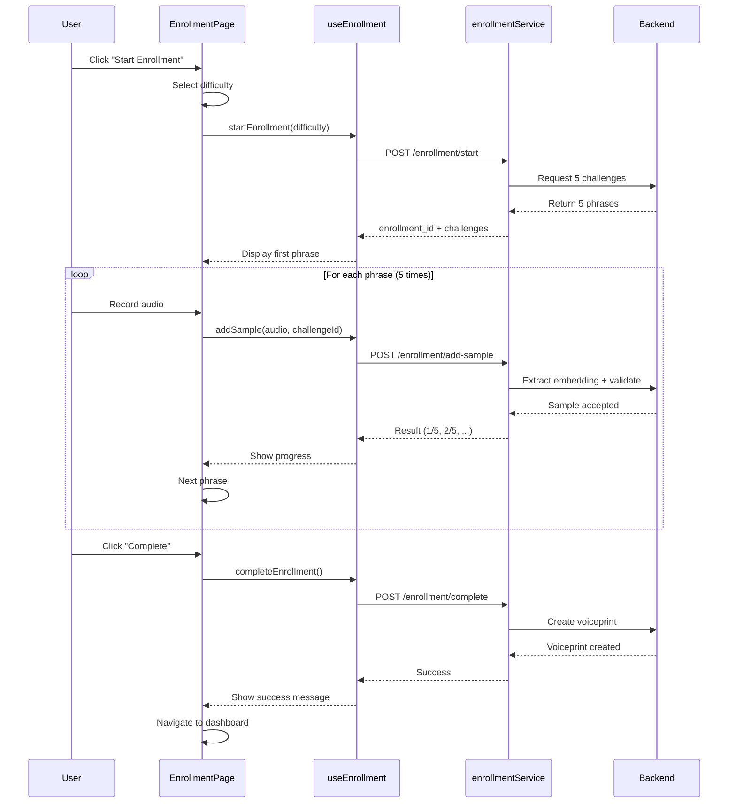
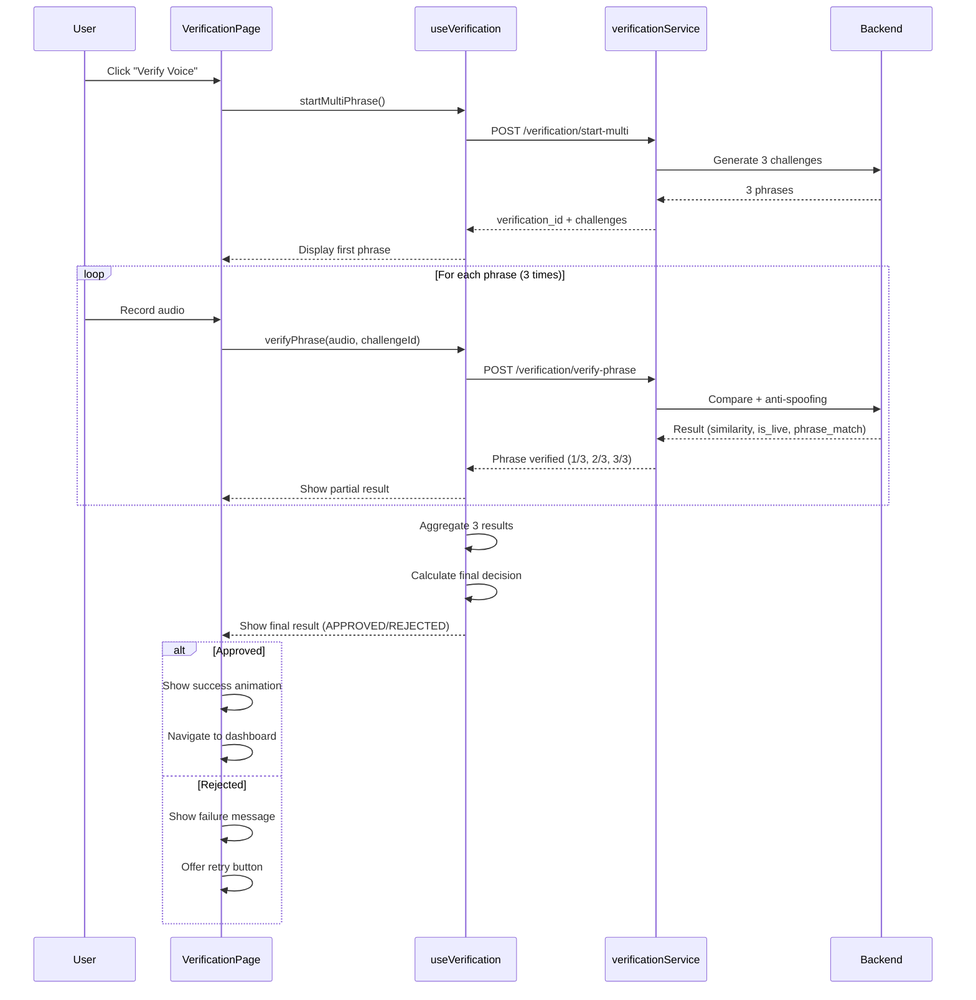

# Documentación Completa del Frontend - Voice Biometrics System

## Índice

1. [Visión General](#visión-general)
2. [Arquitectura del Sistema](#arquitectura-del-sistema)
3. [Estructura de Directorios](#estructura-de-directorios)
4. [Routing y Navegación](#routing-y-navegación)
5. [Gestión de Estado](#gestión-de-estado)
6. [Componentes](#componentes)
7. [Páginas](#páginas)
8. [Servicios y API Client](#servicios-y-api-client)
9. [Hooks Personalizados](#hooks-personalizados)
10. [Estilos y Theming](#estilos-y-theming)
11. [Configuración y Deployment](#configuración-y-deployment)
12. [Flujos de Usuario](#flujos-de-usuario)
13. [Testing](#testing)
14. [Performance y Optimización](#performance-y-optimización)

---

## 1. Visión General

### Descripción del Sistema

El **Voice Biometrics Frontend** es una aplicación web moderna construida con React que proporciona una interfaz de usuario completa para el sistema de autenticación biométrica por voz. La aplicación permite a los usuarios:

- **Registrarse e iniciar sesión** con credenciales
- **Enrollar su voz** (registro de huella vocal)
- **Verificarse mediante voz** (autenticación biométrica)
- **Gestionar su perfil** y configuraciones
- **Ver historial** de verificaciones
- **Administrar el sistema** (roles admin y superadmin)

### Características Principales

✅ **React 19** con TypeScript strict mode  
✅ **Vite** para desarrollo y build ultra-rápido  
✅ **TailwindCSS 4** con diseño responsive
  
✅ **React Router v7** con code splitting  
✅ **React Query** para gestión de estado del servidor  
✅ **Context API** para estado global  
✅ **Dark Mode** con persistencia  
✅ **PWA Ready** con service workers  
✅ **Accessibility (a11y)** compliant  
✅ **Lazy Loading** de componentes  
✅ **Error Boundaries** para manejo de erroes  
✅ **Toast Notifications** con react-hot-toast  

### Stack Tecnológico

| Categoría | Tecnologías |
|-----------|------------|
| **Core** | React 19.2.0, TypeScript 5.x |
| **Build Tool** | Vite 7.2.2, Bun 1.x |
| **Routing** | React Router DOM 7.9.6 |
| **State Management** | React Query 5.90.9, Context API |
| **Styling** | TailwindCSS 4.1.17, CSS Modules |
| **UI Components** | Lucide React (icons) |
| **Form Validation** | Zod 4.1.12 |
| **HTTP Client** | Axios 1.13.2 |
| **Notifications** | React Hot Toast 2.6.0 |
| **Testing** | Vitest, Testing Library |
| **Linting** | ESLint 9.39.1, Prettier |

---

## 2. Arquitectura del Sistema

### Patrón de Arquitectura

El frontend sigue un patrón de **arquitectura basada en componentes** con separación de responsabilidades:

```
┌─────────────────────────────────────────────────────────┐
│                    Presentation Layer                    │
│   Pages - Vistas completas que componen rutas           │
│  ┌──────────┐  ┌──────────┐  ┌──────────┐  ┌─────────┐│
│  │ Login    │  │Dashboard │  │Enrollment│  │ Admin   ││
│  │ Page     │  │ Page     │  │ Page     │  │ Pages   ││
│  └────┬─────┘  └────┬─────┘  └────┬─────┘  └────┬────┘│
└───────┼─────────────┼──────────────┼──────────────┼─────┘
        │             │              │              │
┌───────┴─────────────┴──────────────┴──────────────┴─────┐
│                Component Layer                           │
│   Componentes reutilizables y específicos de dominio    │
│  ┌──────────┐  ┌──────────┐  ┌──────────┐  ┌─────────┐│
│  │   UI     │  │   Auth   │  │Enrollment│  │ Verif.  ││
│  │Components│  │Components│  │Components│  │Components││
│  └────┬─────┘  └────┬─────┘  └────┬─────┘  └────┬────┘│
└───────┼─────────────┼──────────────┼──────────────┼─────┘
        │             │              │              │
┌───────┴─────────────┴──────────────┴──────────────┴─────┐
│                   Business Logic                         │
│   Hooks + Context + Services                             │
│  ┌──────────┐  ┌──────────┐  ┌──────────┐  ┌─────────┐│
│  │  Custom  │  │ Context  │  │ Services │  │  Utils  ││
│  │  Hooks   │  │Providers │  │(API)     │  │Helpers  ││
│  └────┬─────┘  └────┬─────┘  └────┬─────┘  └────┬────┘│
└───────┼─────────────┼──────────────┼──────────────┼─────┘
        │             │              │              │
┌───────┴─────────────┴──────────────┴──────────────┴─────┐
│                  Data Layer                              │
│   API Client + Local Storage + React Query Cache        │
│  ┌──────────────┐  ┌──────────────┐  ┌──────────────┐  │
│  │   Axios      │  │    Local     │  │React Query   │  │
│  │   Client     │  │   Storage    │  │    Cache     │  │
│  └──────────────┘  └──────────────┘  └──────────────┘  │
└──────────────────────────────────────────────────────────┘
```

### Flujo de Datos

```
User Interaction (UI Event)
    ↓
Component Handler
    ↓
Custom Hook (Business Logic)
    ↓
Service Layer (API Call)
    ↓
Axios Client
    ↓
Backend API
    ↓
Response
    ↓
React Query Cache Update
    ↓
Context State Update (if needed)
    ↓
Component Re-render
    ↓
UI Update
```

### Principios de Diseño

1. **Component Composition**: Componentes pequeños y reutilizables
2. **Single Responsibility**: Cada componente tiene un propósito único
3. **Props Drilling Avoidance**: Context API para estado global
4. **Server State Separation**: React Query para estado del servidor
5. **Code Splitting**: Lazy loading de rutas
6. **Type Safety**: TypeScript en modo strict
7. **Accessibility First**: ARIA labels y navegación por teclado

---

## 3. Estructura de Directorios

```
App/
├── public/                        # Archivos estáticos
│   └── vite.svg                   # Favicon
│
├── src/
│   ├── main.tsx                   # Punto de entrada
│   ├── App.tsx                    # Componente raíz con providers
│   ├── index.css                  # Estilos globales + Tailwind
│   ├── vite-env.d.ts              # Type definitions de Vite
│   │
│   ├── assets/                    # Recursos estáticos (images, fonts)
│   │
│   ├── components/                # 🧩 Componentes reutilizables
│   │   ├── ui/                    # Componentes base UI (25 componentes)
│   │   │   ├── Button.tsx
│   │   │   ├── Card.tsx
│   │   │   ├── Input.tsx
│   │   │   ├── Modal.tsx
│   │   │   ├── Sidebar.tsx
│   │   │   ├── Navbar.tsx
│   │   │   ├── LoadingSpinner.tsx
│   │   │   ├── ErrorBoundary.tsx
│   │   │   ├── SkipLink.tsx
│   │   │   ├── ConnectionStatus.tsx
│   │   │   ├── PWAInstallPrompt.tsx
│   │   │   └── ...
│   │   │
│   │   ├── auth/                  # Componentes de autenticación
│   │   │   ├── LoginForm.tsx
│   │   │   └── RegisterForm.tsx
│   │   │
│   │   ├── enrollment/            # Componentes de enrollment (9)
│   │   │   ├── EnrollmentWizard.tsx
│   │   │   ├── PhraseDisplay.tsx
│   │   │   ├── AudioRecorder.tsx
│   │   │   ├── RecordingControls.tsx
│   │   │   ├── ProgressIndicator.tsx
│   │   │   └── ...
│   │   │
│   │   ├── verification/          # Componentes de verificación (4)
│   │   │   ├── VerificationWizard.tsx
│   │   │   ├── MultiPhraseFlow.tsx
│   │   │   ├── ResultDisplay.tsx
│   │   │   └── ...
│   │   │
│   │   ├── admin/                 # Componentes de administración (6)
│   │   │   ├── StatsCard.tsx
│   │   │   ├── UserTable.tsx
│   │   │   ├── PhrasesTable.tsx
│   │   │   └── ...
│   │   │
│   │   └── CountdownTimer.tsx     # Otros componentes
│   │
│   ├── pages/                     # 📄 Páginas/Views (rutas)
│   │   ├── LoginPage.tsx
│   │   ├── RegisterPage.tsx
│   │   ├── DashboardPage.tsx
│   │   ├── EnrollmentPage.tsx
│   │   ├── VerificationPage.tsx
│   │   ├── HistoryPage.tsx
│   │   ├── ProfilePage.tsx
│   │   ├── SettingsPage.tsx
│   │   ├── SuperAdminDashboard.tsx
│   │   │
│   │   └── admin/                 # Páginas de admin
│   │       ├── AdminDashboardPage.tsx
│   │       ├── UsersListPage.tsx
│   │       ├── UserDetailPage.tsx
│   │       ├── PhrasesPage.tsx
│   │       ├── AuditLogsPage.tsx
│   │       └── PhraseRulesPage.tsx
│   │
│   ├── context/                   # 🔄 React Context providers
│   │   ├── AuthContext.tsx        # Estado de autenticación
│   │   ├── ThemeContext.tsx       # Dark/Light mode
│   │   ├── SettingsContext.tsx    # Configuraciones globales
│   │   ├── SettingsModalContext.tsx
│   │   └── theme.ts               # Configuración de tema
│   │
│   ├── hooks/                     # 🪝 Custom Hooks (10 hooks)
│   │   ├── useAuth.ts             # Hook de autenticación
│   │   ├── useTheme.ts            # Hook de tema
│   │   ├── useSettings.ts         # Hook de settings
│   │   ├── useEnrollment.ts       # Hook de enrollment
│   │   ├── useVerification.ts     # Hook de verificación
│   │   ├── useAudioRecorder.ts    # Hook para grabar audio
│   │   ├── useLocalStorage.ts     # Hook para localStorage
│   │   ├── useDebounce.ts         # Debounce hook
│   │   ├── useMediaQuery.ts       # Responsive hook
│   │   └── useOnlineStatus.ts     # Online/offline detection
│   │
│   ├── services/                  # 🌐 API Services (13 servicios)
│   │   ├── api.ts                 # Axios client configurado
│   │   ├── apiServices.ts         # Servicios generales de API
│   │   ├── enrollmentService.ts   # API de enrollment
│   │   ├── verificationService.ts # API de verification
│   │   ├── phraseService.ts       # API de frases
│   │   ├── adminService.ts        # API de admin
│   │   ├── phraseRulesService.ts  # API de reglas de frases
│   │   ├── storage.ts             # LocalStorage service
│   │   └── mockApi.ts             # Mock API para testing
│   │
│   ├── types/                     # 📝 TypeScript types
│   │   ├── index.ts               # Tipos principales
│   │   ├── api.ts                 # Tipos de API
│   │   └── ui.ts                  # Tipos de UI
│   │
│   ├── utils/                     # 🛠️ Utilidades (7 utils)
│   │   ├── validators.ts          # Validación de datos
│   │   ├── formatters.ts          # Formateo de strings/dates
│   │   ├── audioHelpers.ts        # Helpers de audio
│   │   ├── errorHandlers.ts       # Manejo de errores
│   │   ├── constants.ts           # Constantes globales
│   │   ├── cn.ts                  # Class name utility
│   │   └── dateUtils.ts           # Utilidades de fecha
│   │
│   ├── config/                    # ⚙️ Configuración
│   │   ├── env.ts                 # Variables de entorno
│   │   └── constants.ts           # Constantes de config
│   │
│   └── test/                      # 🧪 Test utilities
│       ├── setup.ts
│       ├── mocks.ts
│       └── test-utils.tsx
│
├── .env.development               # Env vars desarrollo
├── .env.production                # Env vars producción
├── .env.example                   # Plantilla de env vars
├── package.json                   # Dependencies y scripts
├── bun.lock                       # Lock file de Bun
├── tsconfig.json                  # TypeScript config
├── vite.config.ts                 # Vite configuration
├── vitest.config.ts               # Vitest configuration
├── tailwind.config.ts             # Tailwind configuration
├── eslint.config.js               # ESLint rules
├── .prettierrc                    # Prettier config
└── index.html                     # HTML template
```

### Convenciones de Nomenclatura

**Archivos**:
- Componentes: `PascalCase.tsx`
- Hooks: `use*.ts`
- Servicios: `*Service.ts`
- Utils: `camelCase.ts`
- Types: `*.types.ts` o dentro de `types/`

**Componentes**:
- Functional components con TypeScript
- Props interface: `ComponentNameProps`
- Export default: Solo para páginas
- Named exports: Para componentes reutilizables

**Estilos**:
- Tailwind utility classes preferidas
- CSS modules cuando sea necesario
- BEM para clases custom

---

## 4. Routing y Navegación

### Sistema de Rutas

El sistema usa **React Router v7** con lazy loading y protección de rutas basada en roles.

#### Estructura de Rutas

```typescript
// App.tsx

<Routes>
  {/* Public Routes */}
  <Route path="/login" element={<PublicRoute><LoginPage /></PublicRoute>} />
  <Route path="/register" element={<PublicRoute><RegisterPage /></PublicRoute>} />
  
  {/* User Routes (protected, userOnly) */}
  <Route path="/dashboard" element={<ProtectedRoute userOnly><DashboardPage /></ProtectedRoute>} />
  <Route path="/enrollment" element={<ProtectedRoute userOnly><EnrollmentPage /></ProtectedRoute>} />
  <Route path="/verification" element={<ProtectedRoute userOnly><VerificationPage /></ProtectedRoute>} />
  <Route path="/history" element={<ProtectedRoute><HistoryPage /></ProtectedRoute>} />
  <Route path="/profile" element={<ProtectedRoute><ProfilePage /></ProtectedRoute>} />
  <Route path="/settings" element={<ProtectedRoute><SettingsPage /></ProtectedRoute>} />
  
  {/* Admin Routes (protected, adminOnly) */}
  <Route path="/admin" element={<Navigate to="/admin/dashboard" />} />
  <Route path="/admin/dashboard" element={<ProtectedRoute adminOnly><AdminDashboardPage /></ProtectedRoute>} />
  <Route path="/admin/users" element={<ProtectedRoute adminOnly><UsersListPage /></ProtectedRoute>} />
  <Route path="/admin/users/:id" element={<ProtectedRoute adminOnly><UserDetailPage /></ProtectedRoute>} />
  <Route path="/admin/phrases" element={<ProtectedRoute adminOnly><PhrasesPage /></ProtectedRoute>} />
  <Route path="/admin/logs" element={<ProtectedRoute adminOnly><AuditLogsPage /></ProtectedRoute>} />
  <Route path="/admin/phrase-rules" element={<ProtectedRoute adminOnly><PhraseRulesPage /></ProtectedRoute>} />
  
  {/* Super Admin Route */}
  <Route path="/super-admin" element={<ProtectedRoute superAdminOnly><SuperAdminDashboard /></ProtectedRoute>} />
  
  {/* Default & 404 */}
  <Route path="/" element={<Navigate to="/dashboard" replace />} />
  <Route path="*" element={<Navigate to="/dashboard" replace />} />
</Routes>
```

#### Rutas Protegidas

```typescript
interface ProtectedRouteProps {
  children: React.ReactNode;
  adminOnly?: boolean;
  superAdminOnly?: boolean;
  userOnly?: boolean;
}

const ProtectedRoute: React.FC<ProtectedRouteProps> = ({
  children,
  adminOnly = false,
  superAdminOnly = false,
  userOnly = false,
}) => {
  const { isAuthenticated, user, isLoading } = useAuth();

  // Show spinner while checking auth
  if (isLoading) return <LoadingSpinner />;

  // Redirect to login if not authenticated
  if (!isAuthenticated) return <Navigate to="/login" replace />;

  // Super admin check
  if (superAdminOnly && user?.role !== 'superadmin') {
    return <Navigate to="/dashboard" replace />;
  }

  // Admin check (includes superadmin)
  if (adminOnly && !['admin', 'superadmin'].includes(user?.role ?? '')) {
    return <Navigate to="/dashboard" replace />;
  }

  // Regular user check (redirect admins to admin dashboard)
  if (userOnly && ['admin', 'superadmin'].includes(user?.role ?? '')) {
    return <Navigate to="/admin/dashboard" replace />;
  }

  return <>{children}</>;
};
```

**Logic**:
1. **isLoading**: Muestra spinner durante verificación de auth
2. **!isAuthenticated**: Redirige a `/login`
3. **superAdminOnly**: Solo permite superadmins
4. **adminOnly**: Permite admins y superadmins
5. **userOnly**: Solo usuarios regulares, redirige admins a su dashboard

#### Lazy Loading

```typescript
// Code splitting para mejorar performance
const LoginPage = lazy(() => import('./pages/LoginPage'));
const RegisterPage = lazy(() => import('./pages/RegisterPage'));
const DashboardPage = lazy(() => import('./pages/DashboardPage'));
// ... más páginas

// Suspense wrapper con fallback
<Suspense fallback={<LoadingSpinner />}>
  <Routes>
    {/* ... rutas */}
  </Routes>
</Suspense>
```

**Beneficios**:
- Reduce bundle inicial
- Carga páginas solo cuando se necesitan
- Mejora time-to-interactive

#### Navigation Programática

```typescript
import { useNavigate } from 'react-router-dom';

function MyComponent() {
  const navigate = useNavigate();
  
  const handleSuccess = () => {
    navigate('/dashboard');
  };
  
  const handleBack = () => {
    navigate(-1); // Go back
  };
  
  return (/* ... */);
}
```

---

## 5. Gestión de Estado

### Estrategia de Estado

El sistema usa una **estrategia híbrida** de gestión de estado:

1. **React Query**: Estado del servidor (API data, cache)
2. **Context API**: Estado global de la aplicación
3. **Local State**: Estado local de componentes (`useState`)
4. **Local Storage**: Persistencia de preferencias

```
┌──────────────────────────────────────────┐
│         Client State (Frontend)          │
│  ┌────────────┐  ┌───────────────────┐  │
│  │  Context   │  │   Local State     │  │
│  │    API     │  │   (useState)      │  │
│  │ - Auth     │  │ - Form inputs     │  │
│  │ - Theme    │  │ - UI toggles      │  │
│  │ - Settings │  │ - Modals          │  │
│  └────────────┘  └───────────────────┘  │
└──────────────────────────────────────────┘
┌──────────────────────────────────────────┐
│         Server State (Backend)           │
│  ┌────────────────────────────────────┐  │
│  │         React Query                │  │
│  │  - Users data                      │  │
│  │  - Enrollment status               │  │
│  │  - Verification history            │  │
│  │  - Admin stats                     │  │
│  │  - Phrase library                  │  │
│  └────────────────────────────────────┘  │
└──────────────────────────────────────────┘
┌──────────────────────────────────────────┐
│      Persistence (LocalStorage)          │
│  - Theme preference                      │
│  - Language preference                   │
│  - Last enrolled timestamp               │
│  - Settings                              │
└──────────────────────────────────────────┘
```

### Context Providers

#### AuthContext

**Archivo**: `src/context/AuthContext.tsx`

```typescript
interface AuthContextType {
  user: User | null;
  isAuthenticated: boolean;
  isLoading: boolean;
  login: (email: string, password: string) => Promise<void>;
  register: (data: RegisterData) => Promise<void>;
  logout: () => void;
  updateUser: (user: User) => void;
}

export const AuthProvider: React.FC<{ children: React.ReactNode }> = ({ children }) => {
  const [user, setUser] = useState<User | null>(null);
  const [isLoading, setIsLoading] = useState(true);

  useEffect(() => {
    // Check for existing token on mount
    const token = localStorage.getItem('access_token');
    if (token) {
      loadUserFromToken(token);
    } else {
      setIsLoading(false);
    }
  }, []);

  const login = async (email: string, password: string) => {
    const response = await apiServices.login(email, password);
    localStorage.setItem('access_token', response.access_token);
    localStorage.setItem('refresh_token', response.refresh_token);
    setUser(response.user);
  };

  const logout = () => {
    localStorage.removeItem('access_token');
    localStorage.removeItem('refresh_token');
    setUser(null);
  };

  return (
    <AuthContext.Provider value={{ user, isAuthenticated: !!user, isLoading, login, register, logout, updateUser }}>
      {children}
    </AuthContext.Provider>
  );
};
```

**Uso**:
```typescript
const { user, isAuthenticated, login, logout } = useAuth();
```

#### ThemeContext

**Archivo**: `src/context/ThemeContext.tsx`

```typescript
type Theme = 'light' | 'dark' | 'system';

interface ThemeContextType {
  theme: Theme;
  effectiveTheme: 'light' | 'dark';
  setTheme: (theme: Theme) => void;
}

export const ThemeProvider: React.FC<{ children: React.ReactNode }> = ({ children }) => {
  const [theme, setThemeState] = useState<Theme>(() => {
    return (localStorage.getItem('theme') as Theme) || 'system';
  });

  const setTheme = (newTheme: Theme) => {
    setThemeState(newTheme);
    localStorage.setItem('theme', newTheme);
  };

  // Apply theme to document
  useEffect(() => {
    const root = document.documentElement;
    const effectiveTheme = theme === 'system' 
      ? window.matchMedia('(prefers-color-scheme: dark)').matches ? 'dark' : 'light'
      : theme;
    
    root.classList.remove('light', 'dark');
    root.classList.add(effectiveTheme);
  }, [theme]);

  return (
    <ThemeContext.Provider value={{ theme, effectiveTheme, setTheme }}>
      {children}
    </ThemeContext.Provider>
  );
};
```

**Features**:
- Soporte para `light`, `dark`, `system`
- Persistencia en localStorage
- Detección de preferencia del OS

#### SettingsContext

**Archivo**: `src/context/SettingsContext.tsx`

Gestiona configuraciones globales de la aplicación:
- Language
- Audio quality
- Recording duration
- Notifications

### React Query Setup

**Archivo**: `src/App.tsx`

```typescript
const queryClient = new QueryClient({
  defaultOptions: {
    queries: {
      retry: 1,
      staleTime: 5 * 60 * 1000, // 5 minutes
      refetchOnWindowFocus: false,
    },
  },
});

function App() {
  return (
    <QueryClientProvider client={queryClient}>
      {/* ... */}
    </QueryClientProvider>
  );
}
```

**Uso en componentes**:

```typescript
// Fetch data
const { data, isLoading, error } = useQuery({
  queryKey: ['users'],
  queryFn: () => adminService.getUsers(),
});

// Mutations
const mutation = useMutation({
  mutationFn: (data: EnrollData) => enrollmentService.addSample(data),
  onSuccess: () => {
    queryClient.invalidateQueries({ queryKey: ['enrollment-status'] });
    toast.success('Sample added!');
  },
});
```

---

## 6. Componentes

### Organización de Componentes

Los componentes están organizados por **dominio/función**:

#### UI Components (`components/ui/`)

Componentes base reutilizables:

| Componente | Descripción | Props Principales |
|-----------|-------------|-------------------|
| **Button** | Botón con variants | `variant`, `size`, `loading`, `disabled` |
| **Card** | Contenedor de contenido | `title`, `children`, `className` |
| **Input** | Campo de entrada | `type`, `label`, `error`, `value`, `onChange` |
| **Modal** | Modal/Dialog | `isOpen`, `onClose`, `title`, `children` |
| **Sidebar** | Navegación lateral | `items`, `activeitem`, `onNavigate` |
| **Navbar** | Barra de navegación | `user`, `onLogout` |
| **LoadingSpinner** | Indicador de carga | `size`, `color` |
| **ErrorBoundary** | Manejador de errores | `fallback`, `onError` |
| **Toast** | Notificación temporal | Usa react-hot-toast |
| **SkipLink** | Accesibilidad | - |
| **ConnectionStatus** | Online/offline | - |
| **PWAInstallPrompt** | Prompt de instalación PWA | - |

**Ejemplo: Button Component**

```typescript
// components/ui/Button.tsx

interface ButtonProps extends React.ButtonHTMLAttributes<HTMLButtonElement> {
  variant?: 'primary' | 'secondary' | 'danger';
  size?: 'sm' | 'md' | 'lg';
  loading?: boolean;
  icon?: React.ReactNode;
}

export const Button: React.FC<ButtonProps> = ({
  children,
  variant = 'primary',
  size = 'md',
  loading = false,
  icon,
  disabled,
  className,
  ...props
}) => {
  const baseStyles = 'rounded-lg font-medium transition-all focus:outline-none focus:ring-2';
  
  const variantStyles = {
    primary: 'bg-blue-600 hover:bg-blue-700 text-white',
    secondary: 'bg-gray-200 hover:bg-gray-300 text-gray-800',
    danger: 'bg-red-600 hover:bg-red-700 text-white',
  };
  
  const sizeStyles = {
    sm: 'px-3 py-1.5 text-sm',
    md: 'px-4 py-2 text-base',
    lg: 'px-6 py-3 text-lg',
  };

  return (
    <button
      className={cn(baseStyles, variantStyles[variant], sizeStyles[size], className)}
      disabled={disabled || loading}
      {...props}
    >
      {loading && <Spinner className="mr-2" />}
      {icon && <span className="mr-2">{icon}</span>}
      {children}
    </button>
  );
};
```

#### Auth Components (`components/auth/`)

| Componente | Descripción |
|-----------|-------------|
| **LoginForm** | Formulario de login con validación |
| **RegisterForm** | Formulario de registro con validación Zod |

#### Enrollment Components (`components/enrollment/`)

| Componente | Descripción |
|-----------|-------------|
| **EnrollmentWizard** | Flujo completo de enrollment (5 pasos) |
| **PhraseDisplay** | Muestra la frase a leer |
| **AudioRecorder** | Componente de grabación de audio |
| **RecordingControls** | Controles de grabación (start/stop) |
| **ProgressIndicator** | Barra de progreso (1/5, 2/5...) |
| **WaveformVisu alizer** | Visualización de onda de audio |
| **QualityIndicator** | Indicador de calidad de audio |
| **CompletionSummary** | Resumen de enrollment completado |
| **EnrollmentGuide** | Instrucciones paso a paso |

**Ejemplo: Audio Recorder**

```typescript
// components/enrollment/AudioRecorder.tsx

interface AudioRecorderProps {
  onRecordingComplete: (audioBlob: Blob) => void;
  maxDuration?: number;
  phraseText: string;
}

export const AudioRecorder: React.FC<AudioRecorderProps> = ({
  onRecordingComplete,
  maxDuration = 10,
  phraseText,
}) => {
  const {
    isRecording,
    audioBlob,
    startRecording,
    stopRecording,
    duration,
  } = useAudioRecorder({ maxDuration });

  useEffect(() => {
    if (audioBlob) {
      onRecordingComplete(audioBlob);
    }
  }, [audioBlob]);

  return (
    <div className="space-y-4">
      <PhraseDisplay text={phraseText} />
      
      <WaveformVisualizer isRecording={isRecording} />
      
      <RecordingControls
        isRecording={isRecording}
        onStart={startRecording}
        onStop={stopRecording}
        duration={duration}
      />
      
      {audioBlob && <AudioPlayback blob={audioBlob} />}
    </div>
  );
};
```

#### Verification Components (`components/verification/`)

| Componente | Descripción |
|-----------|-------------|
| **VerificationWizard** | Flujo de verificación multi-frase (3) |
| **MultiPhraseFlow** | Gestión de 3 frases secuenciales |
| **ResultDisplay** | Muestra resultado de verificación |
| **ConfidenceScore** | Visualización de confianza |

#### Admin Components (`components/admin/`)

| Componente | Descripción |
|-----------|-------------|
| **StatsCard** | Tarjeta de estadística |
| **UserTable** | Tabla de usuarios con paginación |
| **PhrasesTable** | Tabla de frases |
| **AuditLogTable** | Tabla de logs de auditoría |
| **ChartComponent** | Gráficos con Chart.js |
| **FilterControls** | Controles de filtrado |

---

## 7. Páginas

### User Pages

#### DashboardPage

**Archivo**: `src/pages/DashboardPage.tsx`

**Contenido**:
- Tarjeta de bienvenida
- Estado de enrollment
- Botones de acción rápida (Enroll/Verify)
- Estadísticas del usuario
- Historial reciente

**Layout**:
```
┌─────────────────────────────────────────┐
│ Sidebar │  Navbar                       │
├─────────┼─────────────────────────────  ┤
│         │ Welcome Card                  │
│ Nav     │ ┌──────────────────────┐      │
│ Items   │ │ Enrollment Status    │      │
│         │ └──────────────────────┘      │
│         │                               │
│         │ Quick Actions                 │
│         │ [Enroll] [Verify]             │
│         │                               │
│         │ Recent Activity               │
│         │ ┌──────────────────────┐      │
│         │ │ Verification history │      │
│         │ └──────────────────────┘      │
└─────────┴───────────────────────────────┘
```

#### EnrollmentPage

**Archivo**: `src/pages/EnrollmentPage.tsx`

**Flujo**:
1. Seleccionar dificultad (easy/medium/hard)
2. Ver instrucciones
3. Grabar 5 frases secuencialmente
4. Ver progreso (1/5, 2/5, ...)
5. Completar enrollment

**Componentes usados**:
- `EnrollmentWizard`
- `AudioRecorder`
- `ProgressIndicator`
- `CompletionSummary`

#### VerificationPage

**Archivo**: `src/pages/VerificationPage.tsx`

**Flujo**:
1. Verificar enrollment previo
2. Seleccionar dificultad
3. Grabar 3 frases secuencialmente
4. Ver resultados parciales
5. Ver resultado final (approved/rejected)

**Decisión**:
- **Approved**: Si 3/3 frases pasan + similarity >= threshold
- **Rejected**: Si alguna falla anti-spoofing o similarity baja

#### ProfilePage

**Archivo**: `src/pages/ProfilePage.tsx`

**Secciones**:
- Información personal
- Cambiar contraseña
- Estado de enrollment
- Re-enrollment (si es necesario)
- Configuraciones de cuenta

#### HistoryPage

**Archivo**: `src/pages/HistoryPage.tsx`

**Contenido**:
- Tabla de verificaciones anteriores
- Filtros (fecha, resultado)
- Detalles de cada verificación
- Paginación

### Admin Pages

#### AdminDashboardPage

**Archivo**: `src/pages/admin/AdminDashboardPage.tsx`

**Contenido**:
- Stats cards (users, enrollments, verifications)
- Gráficos de actividad
- Tabla de usuarios recientes
- Tabla de verificaciones recientes

#### UsersListPage

**Archivo**: `src/pages/admin/UsersListPage.tsx`

**Features**:
- Tabla de todos los usuarios
- Filtros (role, enrollment status)
- Búsqueda por nombre/email
- Paginación
- Acciones (ver detalle, editar, eliminar)

#### PhrasesPage

**Archivo**: `src/pages/admin/PhrasesPage.tsx`

**Features**:
- Tabla de frases de la BD
- Filtros (difficulty, book, author)
- Estadísticas de uso
- Paginación

---

## 8. Servicios y API Client

### Axios Client

**Archivo**: `src/services/api.ts`

```typescript
import axios from 'axios';

const API_BASE_URL = import.meta.env.VITE_API_BASE_URL || 'http://localhost:8000';

export const apiClient = axios.create({
  baseURL: `${API_BASE_URL}/api`,
  headers: {
    'Content-Type': 'application/json',
  },
});

// Request interceptor: Add JWT token
apiClient.interceptors.request.use(
  (config) => {
    const token = localStorage.getItem('access_token');
    if (token) {
      config.headers.Authorization = `Bearer ${token}`;
    }
    return config;
  },
  (error) => Promise.reject(error)
);

// Response interceptor: Handle 401 errors
apiClient.interceptors.response.use(
  (response) => response,
  async (error) => {
    const originalRequest = error.config;

    // If 401 and not already retried, try refresh token
    if (error.response?.status === 401 && !originalRequest._retry) {
      originalRequest._retry = true;

      try {
        const refreshToken = localStorage.getItem('refresh_token');
        const response = await axios.post(`${API_BASE_URL}/api/auth/refresh`, {
          refresh_token: refreshToken,
        });

        const { access_token } = response.data;
        localStorage.setItem('access_token', access_token);

        // Retry original request
        originalRequest.headers.Authorization = `Bearer ${access_token}`;
        return apiClient(originalRequest);
      } catch (refreshError) {
        // Refresh failed, logout user
        localStorage.removeItem('access_token');
        localStorage.removeItem('refresh_token');
        window.location.href = '/login';
        return Promise.reject(refreshError);
      }
    }

    return Promise.reject(error);
  }
);
```

**Features**:
- Automatic token injection
- Token refresh on 401
- Logout on refresh failure
- Base URL configuration

### API Services

#### enrollmentService.ts

```typescript
export const enrollmentService = {
  startEnrollment: async (difficulty: string) => {
    const response = await apiClient.post('/enrollment/start', { difficulty });
    return response.data;
  },

  addSample: async (enrollId: string, challengeId: string, audioBlob: Blob) => {
    const formData = new FormData();
    formData.append('enroll_id', enrollId);
    formData.append('challenge_id', challengeId);
    formData.append('audio_file', audioBlob, 'recording.webm');

    const response = await apiClient.post('/enrollment/add-sample', formData, {
      headers: { 'Content-Type': 'multipart/form-data' },
    });
    return response.data;
  },

  completeEnrollment: async (enrollId: string) => {
    const response = await apiClient.post('/enrollment/complete', { enroll_id: enrollId });
    return response.data;
  },

  getEnrollmentStatus: async (userId: string) => {
    const response = await apiClient.get(`/enrollment/status/${userId}`);
    return response.data;
  },
};
```

#### verificationService.ts

```typescript
export const verificationService = {
  startMultiPhrase: async (difficulty: string) => {
    const response = await apiClient.post('/verification/start-multi', { difficulty });
    return response.data;
  },

  verifyPhrase: async (verificationId: string, challengeId: string, audioBlob: Blob) => {
    const formData = new FormData();
    formData.append('verification_id', verificationId);
    formData.append('challenge_id', challengeId);
    formData.append('audio_file', audioBlob, 'verification.webm');

    const response = await apiClient.post('/verification/verify-phrase', formData, {
      headers: { 'Content-Type': 'multipart/form-data' },
    });
    return response.data;
  },

  getHistory: async (userId: string) => {
    const response = await apiClient.get(`/verification/history/${userId}`);
    return response.data;
  },
};
```

---

## 9. Hooks Personalizados

### useAuth

**Archivo**: `src/hooks/useAuth.ts`

```typescript
export const useAuth = () => {
  const context = useContext(AuthContext);
  if (!context) {
    throw new Error('useAuth must be used within AuthProvider');
  }
  return context;
};
```

### useAudioRecorder

**Archivo**: `src/hooks/useAudioRecorder.ts`

```typescript
interface UseAudioRecorderOptions {
  maxDuration?: number;
  onMaxDurationReached?: () => void;
}

export const useAudioRecorder = ({ maxDuration = 10, onMaxDurationReached }: UseAudioRecorderOptions = {}) => {
  const [isRecording, setIsRecording] = useState(false);
  const [audioBlob, setAudioBlob] = useState<Blob | null>(null);
  const [duration, setDuration] = useState(0);
  const mediaRecorderRef = useRef<MediaRecorder | null>(null);
  const chunksRef = useRef<Blob[]>([]);
  const timerRef = useRef<NodeJS.Timeout | null>(null);

  const startRecording = async () => {
    try {
      const stream = await navigator.mediaDevices.getUserMedia({ audio: true });
      const mediaRecorder = new MediaRecorder(stream, {
        mimeType: 'audio/webm;codecs=opus',
      });

      mediaRecorderRef.current = mediaRecorder;
      chunksRef.current = [];

      mediaRecorder.ondataavailable = (event) => {
        if (event.data.size > 0) {
          chunksRef.current.push(event.data);
        }
      };

      mediaRecorder.onstop = () => {
        const blob = new Blob(chunksRef.current, { type: 'audio/webm' });
        setAudioBlob(blob);
        stream.getTracks().forEach((track) => track.stop());
      };

      mediaRecorder.start();
      setIsRecording(true);
      setDuration(0);

      // Start timer
      timerRef.current = setInterval(() => {
        setDuration((prev) => {
          const newDuration = prev + 1;
          if (newDuration >= maxDuration) {
            stopRecording();
            onMaxDurationReached?.();
          }
          return newDuration;
        });
      }, 1000);
    } catch (error) {
      console.error('Failed to start recording:', error);
      toast.error('Failed to access microphone');
    }
  };

  const stopRecording = () => {
    if (mediaRecorderRef.current && isRecording) {
      mediaRecorderRef.current.stop();
      setIsRecording(false);

      if (timerRef.current) {
        clearInterval(timerRef.current);
        timerRef.current = null;
      }
    }
  };

  useEffect(() => {
    return () => {
      if (timerRef.current) {
        clearInterval(timerRef.current);
      }
    };
  }, []);

  return {
    isRecording,
    audioBlob,
    duration,
    startRecording,
    stopRecording,
  };
};
```

### useLocalStorage

**Archivo**: `src/hooks/useLocalStorage.ts`

```typescript
export function useLocalStorage<T>(key: string, initialValue: T) {
  const [storedValue, setStoredValue] = useState<T>(() => {
    try {
      const item = window.localStorage.getItem(key);
      return item ? JSON.parse(item) : initialValue;
    } catch (error) {
      console.error(`Error loading ${key} from localStorage:`, error);
      return initialValue;
    }
  });

  const setValue = (value: T | ((val: T) => T)) => {
    try {
      const valueToStore = value instanceof Function ? value(storedValue) : value;
      setStoredValue(valueToStore);
      window.localStorage.setItem(key, JSON.stringify(valueToStore));
    } catch (error) {
      console.error(`Error saving ${key} to localStorage:`, error);
    }
  };

  return [storedValue, setValue] as const;
}
```

---

## 10. Estilos y Theming

### TailwindCSS Configuration

**Archivo**: `tailwind.config.ts`

```typescript
export default {
  content: ['./index.html', './src/**/*.{js,ts,jsx,tsx}'],
  darkMode: 'class',
  theme: {
    extend: {
      colors: {
        primary: {
          50: '#eff6ff',
          500: '#3b82f6',
          600: '#2563eb',
          700: '#1d4ed8',
        },
        // ... more colors
      },
      animation: {
        'spin-slow': 'spin 3s linear infinite',
        'pulse-slow': 'pulse 3s cubic-bezier(0.4, 0, 0.6, 1) infinite',
      },
    },
  },
  plugins: [],
};
```

### Dark Mode

Implementado con clase `dark` en `<html>`:

```css
/* index.css */
:root {
  --color-bg: #f9fafb;
  --color-text: #111827;
}

.dark {
  --color-bg: #111827;
  --color-text: #f9fafb;
}

body {
  background-color: var(--color-bg);
  color: var(--color-text);
}
```

**Toggle**:
```typescript
const { theme, setTheme } = useTheme();

<button onClick={() => setTheme(theme === 'dark' ? 'light' : 'dark')}>
  {theme === 'dark' ? <Sun /> : <Moon />}
</button>
```

---

## 11. Configuración y Deployment

### Environment Variables

**`.env.development`**:
```env
VITE_API_BASE_URL=http://localhost:8000
VITE_ENV=development
VITE_ENABLE_MOCK=false
VITE_ENABLE_LOGGING=true
```

**`.env.production`**:
```env
VITE_API_BASE_URL=https://api.example.com
VITE_ENV=production
VITE_ENABLE_MOCK=false
VITE_ENABLE_LOGGING=false
```

### Build Commands

```bash
# Development
bun run dev

# Build for production
bun run build

# Preview production build
bun run preview

# Run tests
bun run test

# Lint
bun run lint

# Format
bun run format
```

### Docker Deployment

**Dockerfile** (recomendado):
```dockerfile
FROM oven/bun:1 AS builder
WORKDIR /app
COPY package.json bun.lock ./
RUN bun install --production
COPY . .
RUN bun run build

FROM nginx:alpine
COPY --from=builder /app/dist /usr/share/nginx/html
COPY nginx.conf /etc/nginx/conf.d/default.conf
EXPOSE 80
CMD ["nginx", "-g", "daemon off;"]
```

**nginx.conf**:
```nginx
server {
  listen 80;
  server_name _;
  root /usr/share/nginx/html;
  index index.html;

  location / {
    try_files $uri $uri/ /index.html;
  }

  # Cache static assets
  location ~* \.(js|css|png|jpg|jpeg|gif|ico|svg|woff|woff2)$ {
    expires 1y;
    add_header Cache-Control "public, immutable";
  }
}
```

---

## 12. Flujos de Usuario

### Enrollment Flow



### Verification Flow



---

## 13. Testing

### Unit Tests

**Archivo**: `src/components/__tests__/Button.test.tsx`

```typescript
import { render, screen, fireEvent } from '@testing-library/react';
import { Button } from '../ui/Button';

describe('Button', () => {
  it('renders with children', () => {
    render(<Button>Click me</Button>);
    expect(screen.getByText('Click me')).toBeInTheDocument();
  });

  it('calls onClick when clicked', () => {
    const handleClick = vi.fn();
    render(<Button onClick={handleClick}>Click</Button>);
    fireEvent.click(screen.getByText('Click'));
    expect(handleClick).toHaveBeenCalledTimes(1);
  });

  it('shows loading spinner when loading', () => {
    render(<Button loading>Click</Button>);
    expect(screen.getByRole('status')).toBeInTheDocument();
  });

  it('disables when disabled prop is true', () => {
    render(<Button disabled>Click</Button>);
    expect(screen.getByRole('button')).toBeDisabled();
  });
});
```

### Integration Tests

**Archivo**: `src/pages/__tests__/LoginPage.test.tsx`

```typescript
import { render, screen, waitFor } from '@testing-library/react';
import userEvent from '@testing-library/user-event';
import { LoginPage } from '../LoginPage';
import { BrowserRouter } from 'react-router-dom';

describe('LoginPage', () => {
  it('logs in successfully with valid credentials', async () => {
    const user = userEvent.setup();
    render(
      <BrowserRouter>
        <LoginPage />
      </BrowserRouter>
    );

    await user.type(screen.getByLabelText(/email/i), 'test@example.com');
    await user.type(screen.getByLabelText(/password/i), 'password123');
    await user.click(screen.getByRole('button', { name: /log in/i }));

    await waitFor(() => {
      expect(screen.getByText(/welcome/i)).toBeInTheDocument();
    });
  });
});
```

---

## 14. Performance y Optimización

### Code Splitting

- ✅ Lazy loading de rutas
- ✅ Dynamic imports para componentes grandes
- ✅ Chunk splitting automático por Vite

### Caching

- ✅ React Query cache (5 minutos stale time)
- ✅ LocalStorage para preferencias
- ✅ Service Worker para assets (PWA)

### Optimizaciones de Build

```typescript
// vite.config.ts
export default defineConfig({
  build: {
    rollupOptions: {
      output: {
        manualChunks: {
          'react-vendor': ['react', 'react-dom', 'react-router-dom'],
          'query-vendor': ['@tanstack/react-query'],
          'ui-vendor': ['lucide-react', 'react-hot-toast'],
        },
      },
    },
    chunkSizeWarningLimit: 1000,
  },
});
```

### Performance Metrics

| Métrica | Valor Target |
|---------|-------------|
| First Contentful Paint | < 1.5s |
| Time to Interactive | < 3.5s |
| Largest Contentful Paint | < 2.5s |
| Cumulative Layout Shift | < 0.1 |
| Bundle Size | < 500 KB (gzipped) |

---

## Apéndices

### A. Glosario Frontend

| Término | Definición |
|---------|-----------|
| **Hook** | Función que permite usar estado y features de React |
| **Context** | Sistema de estado global de React |
| **Lazy Loading** | Carga diferida de componentes |
| **Code Splitting** | División del bundle en chunks más pequeños |
| **PWA** | Progressive Web App - instalable como app nativa |
| **SSG** | Static Site Generation |
| **SPA** | Single Page Application |

### B. Shortcuts de Teclado

| Shortcut | Acción |
|----------|--------|
| `Ctrl/Cmd + K` | Abrir búsqueda |
| `Ctrl/Cmd + /` | Toggle sidebar |
| `Esc` | Cerrar modal |
| `Tab` | Navegar entre inputs |
| `Enter` | Submit form |

### C. Estructura de package.json

```json
{
  "name": "voice-biometrics-frontend",
  "version": "1.0.0",
  "scripts": {
    "dev": "vite",
    "build": "tsc && vite build",
    "preview": "vite preview",
    "test": "vitest",
    "lint": "eslint . --ext ts,tsx",
    "format": "prettier --write \"src/**/*.{ts,tsx}\""
  },
  "dependencies": {
    "react": "^19.2.0",
    "react-dom": "^19.2.0",
    "react-router-dom": "^7.9.6",
    "@tanstack/react-query": "^5.90.9",
    "axios": "^1.13.2",
    "tailwindcss": "^4.1.17",
    "zod": "^4.1.12",
    "lucide-react": "^0.553.0",
    "react-hot-toast": "^2.6.0"
  },
  "devDependencies": {
    "@vitejs/plugin-react": "^5.1.1",
    "typescript": "^5.x",
    "vite": "^7.2.2",
    "vitest": "latest"
  }
}
```

---

**Última actualización**: Diciembre 2024  
**Versión**: 1.0.0  
**Mantenido por**: Voice Biometrics Team
